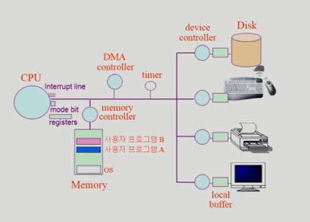

# System Structure & Program Execution 1

컴퓨터 하드웨어적인 동작에 대한 내용

## 컴퓨터 시스템 구조

- computer
  - CPU : 매 클럭사이클마다 Memory에서 기계어를 하나씩 읽어서 실행한다.
    - registers 
      - CPU 내부에 존재 
      - Memory보다 더 빠르면서 정보를 저장할 수 있는 공간
    - mode bit
      - 지금 CPU에서 실행되는 것이 운영체제인지, 사용자 프로그램인지 구분해준다.
      - 1 사용자 모드 : 제한된 instruction만 CPU에서 실행할 수 있다. 사용자 프로그램 수행
      - 0 모니터 모드 : 모든 instruction을 CPU에서 실행가능. OS 코드 수행
    - interrupt line : CPU에 붙어있다. I/O device 작업을 받아온다.
  - Memory
  - DMA controller : I/O device의 interrupt 교통정리
  - timer 
    - 정해진 시간이 흐른 뒤 운영체제에 제어권이 넘어가도록 인터럽트를 발생시킨다.
    - 특정 프로그램이 CPU를 독점하는 것을 막는다. 
    - 할당된 시간이 다 되면 CPU에 interrupt를 건다. CPU는 하나의 instruction이 끝나면 interrupt line을 체크한다. interrupt 들어온 게 없으면 CPU는 다음 instruction 실행한다.
- I/O device
  - 별개의 디바이스(ex. 모니터, 프린터, 하드디스크)
  - device controller(장치제어기)
    - HW
    - 각각의 디바이스 앞에 device controller(각 디바이스를 전담하는 작은 CPU 역할을 함, 디바이스 내부를 통제함)가 붙어있다.
  - local buffer
    - 메인 CPU의 작업공간인 메인 Memory가 있듯이 device controller에도 local buffer라는 작업 공간이 있다.
  - CPU와 I/O device는 성능(처리속도) 차이가 많이 난다. ex. Disk는 CPU보다 백만배 정도 느리다.
  - 사용자 프로그램은 I/O device에 접근할 수 없다. 오직 OS만 가능
  - 참고
    - device driver(장치구동기)
      - SW
      - OS 코드 중 각 장치별 처리루틴
  - 입출력(I/O) 수행
    - 사용자 프로그램은 어떻게 I/O를 하는가?
      - 시스템콜 : 사용자 프로그램은 운영체제에 I/O 요청
      - trap을 사용하여 인터럽트 벡터의 특정 위치로 이동
      - 제어권이 인터럽트 벡터가 가리키는 인터럽트 서비스 루틴으로 이동
      - 올바른 I/O 요청인지 확인 후 I/O 수행
      - I/O 완료 시 제어권을 시스템콜 다음 명령으로 옮김