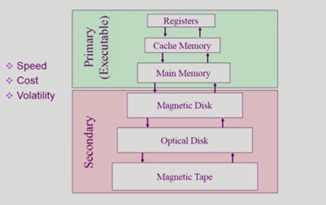
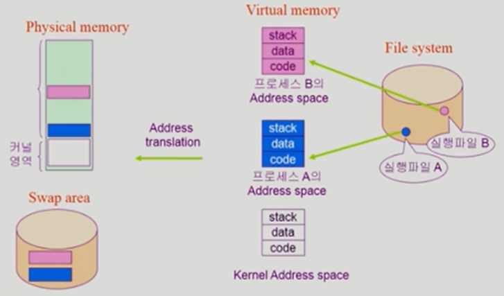
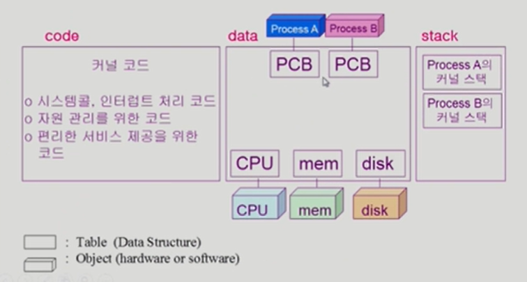
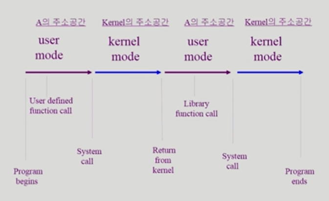

# System Structure & Program Execution 2

### 동기식 입출력과 비동기식 입출력

- 동기식 입출력 (synchronous I/O)
  - I/O 장치까지 가서 확인하고 다음 일을 실행한다.
  - I/O 요청 후 입출력 작업이 완료된 후에야 제어가 사용자 프로그램에 넘어간다.
  - 구현 방법 1
    - I/O 가 끝날 때까지 CPU를 낭비한다.
    - 매시점 하나의 I/O 만 일어날 수 있다.
  - 구현 방법 2
    - I/O 가 완료될 때까지 해당 프로그램에게서 CPU를 빼앗는다.
    - I/O 처리를 기다리는 줄에 그 프로그램을 줄 세운다.
    - 다른 프로그램에게 CPU를 준다.
- 비동기식 입출력 (asynchronous I/O)
  - I/O 하라고 던져놓고 바로 CPU 얻어와서 다른 일 한다.
  - I/O 가 시작된 후 입출력 작업이 끝나기를 기다리지 않고 제어가 사용자 프로그램에 즉시 넘어간다.
- 두 경우 모두 I/O의 완료는 인터럽트로 알려준다.

### DMA (Direct Memory Access)

메모리에 접근할 수 있는 장치는 CPU와 DMA. 

블럭이나 페이지 정도의 데이터가 쌓이면 CPU한테 한번 인터럽트를 걸어 알려준다. 그때 DMA가 I/O device의 데이터를 메모리로 카피를 한다.

- 빠른 입출력 장치를 메모리에 가까운 속도로 처리하기 위해 사용한다.
- CPU의 중재 없이 device controller가 device의 buffer storage의 내용을 메모리에 block 단위로 직접 전송한다.
- 바이트 단위가 아니라 block 단위로 인터럽트를 발생시킨다.

### 서로 다른 입출력 명령어

- I/O를 수행하는 special instruction에 의해
  - 일반적인 I/O 방식
  - Memory를 접근하는 instruction & 각 I/O device를 접근하는 instruction
- Memory Mapped I/O에 의해
  - I/O device에 메모리 주소를 매겨서 메모리에 접근하는 instruction을 통해서

### 저장장치 계층 구조

#### Primary (Executable)

- Registers
- Cache Memory
- Main Memory

#### Secondary

- Magnetic Disk
- Optical Disk
- Magnetic Tape

Speed/Cost/Volatility

위로 갈수록 속도가 빠른 매체를 사용하고, 단위 공간 당 가격이 비싸므로 용량이 적다. primary에 있는 매체는 휘발성 매체, secondary의 매체는 비휘발성.

**Caching** : 당장 필요한 것만 밑에서 위로 올려다 쓰는 것

### 프로그램의 실행 (메모리 load)

A 프로그램을 실행시키면 0번지부터 시작하는 프로그램 A의 주소공간이 생긴다. 당장 필요한 건 물리적인 메모리에 올려놓고 그렇지 않은 건 디스크 공간(ex. swap area : 메모리 연장공간)에 내려놓는다.

file system : 비휘발성  

### 커널 주소 공간의 내용

 커널 코드 : 운영체제가 해야하는 일을 위한

스택 : 사용자 프로그램들이 운영체제 커널의 코드를 불러서 실행하기 때문에 사용자 프로그램마다 커널 스택을 따로 두고 있다.

### 사용자 프로그램이 사용하는 함수

#### 함수 (function)

- 프로세스 A의 Address space
  - 사용자 정의 함수
    - 자신의 프로그램에서 정의한 함수
  - 라이브러리 함수
    - 자신의 프로그램에서 정의하지 않고 갖다 쓴 함수
    - 자신의 프로그램의 실행 파일에 포함되어 있다.
- Kernel Address space
  - 커널 함수
    - 운영체제 프로그램의 함수
    - 커널 함수의 호출 = 시스템 콜

### 프로그램의 실행

