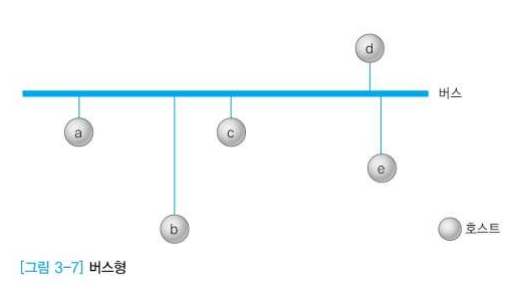
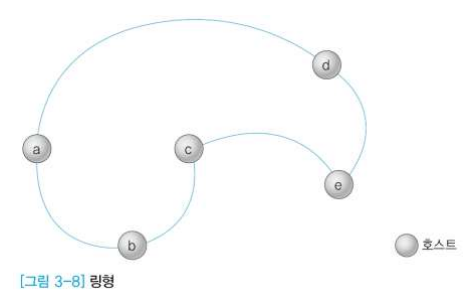
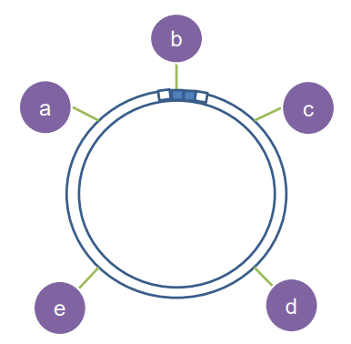
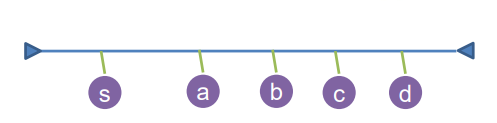
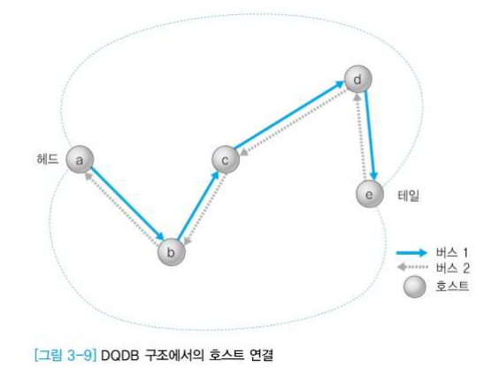
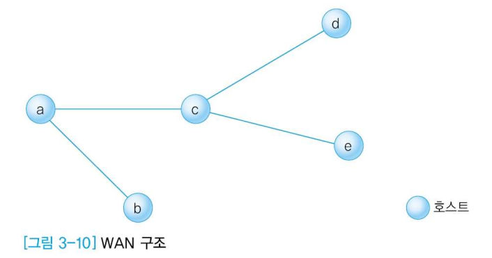

# 3장 2절 LAN, MAN, WAN

### 목표

- LAN, MAN, WAN의 구조 알아보기

## 네트워크의 분류

- 연결 정도에 의한 분류
  - 강한 연결(Tightly coupled)
    - ex. 병렬컴퓨터 내부망
  - 느슨한 연결(Loosely coupled)
    - ex. 전산망(컴퓨터끼리 연결)
- 크기에 의한 분류(정보통신망이 발달하며 경계가 모호)
  - LAN(Local Area Network)
  - MAN(Metropolitan Area Network)
  - WAN(Wide Area Network)

## LAN

- Topology

  - 버스형

  

  주소부분에 b가 e한테 보낸 메시지라고 되어있으면 c는 수신자가 아니니까 데이터 봐도 무시하고 e는 해당 메시지를 복사해 감. 종단간에 터미네이터가 붙어있음.

  - 링형

  

  a가 c에게 보낸다면 c에서 처리 후 다시 메시지를 보낸 쪽(a)으로 돌아와 그 메시지를 제거함.

  

  전송매체로 링이 구성되어 있고, 각각의 호스트들은 정해진 위치에 꽂혀서 관련된 데이터를 탑재하거나 복사할 수 있도록 되어있음.

  

- Ethernet

  - Xerox - Palo Alto 연구소 (ex. PC 개념, 객체지향 개념 만듦 )

  - CSMA/CD(Carrier Sensed Multiple Access Collision Detection) 방식

    - 각 지국이 전송하기 이전에 먼저 매체에 귀를 기울일 것(또는 매체의 상태를 확인)을 요구함
    - 충돌을 감지해서 처리함
    - Carrier Sensed
    - Multiple Access
    - Collision Detection

    

    망 상황을 살핀 후(Carrier Sensed) 데이터를 실어서 보냄. 동시에 데이터를 실었다면(Multiple Access) 충돌이 일어나면 충돌이 일어나니 취소, 포기하는 행위(Collision Detection)를 함. 

- Token Ring

  - 토큰을 주고받는데 링을 구성
  - Token(권리)
    - a가 토큰 가지고 있다면 데이터 다 보낸 후 링에 토큰을 실음. 토큰이 지나가다가 c가 보낼 데이터가 있다면 토큰을 회수해서 데이터를 실음

- Token Bus

  - 토큰을 주고받는데 버스 구성
  - Token(권리)
    - 토큰이 있는 사용자만 데이터를 전송할 수 있음
    - s - a - b - c - d -s : 토큰이 있는 s만 데이터 실음. 더이상 보낼 게 없으면 a한테 토큰을 넘겨줌. 마찬가지로 b, c, d, s 순서로 토큰을 넘겨받음.
    - s - a - b -s - c - d : 우선순위 조정
  - 문제점 : 오류가 생겨서 데이터도 없으면서 독점하는 경우 있음 -> 감시하는 노드 만듦 but 그 감시자도 오동작할 수 있음 => Ethernet이 시장에서 살아남음

  

## MAN

- 도시 규모
- DQDB(Distributed Queue Dual Bus) : 두가닥 버스 형태
- LAN과 WAN의 중간격

## WAN

- 국가 이상의 넓은 지역
- 점대점(Point-to-point) 환경
- 전송(먼거리로 실어보냄) 및 교환 기능(선택해서 전달하는 역할) 필요

