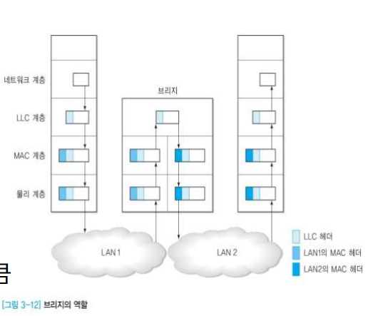
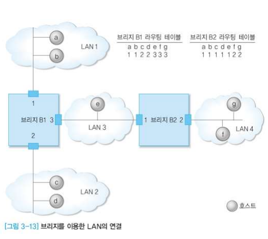
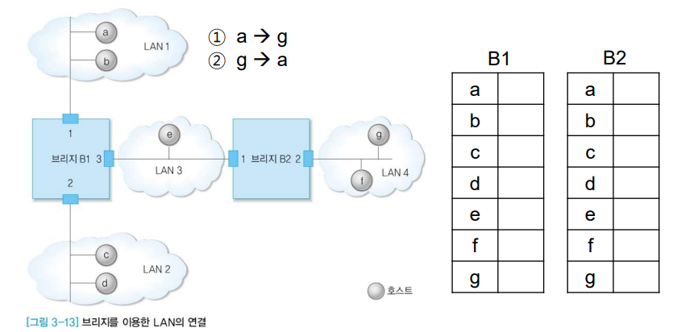
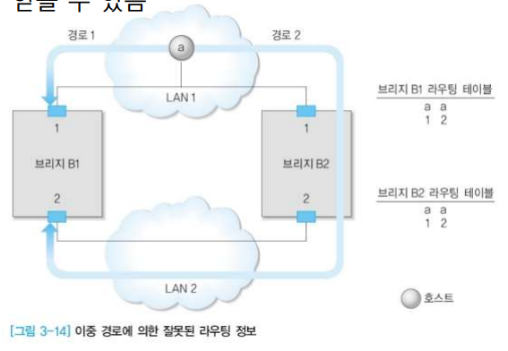
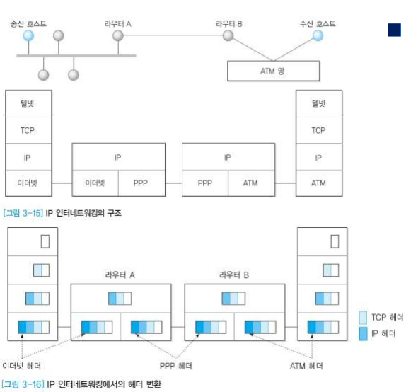
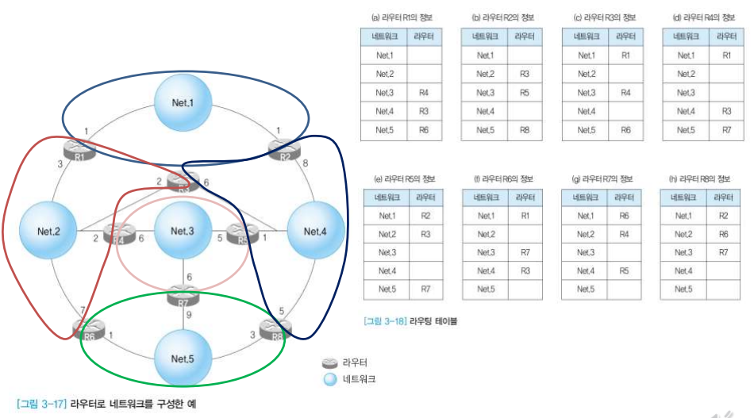
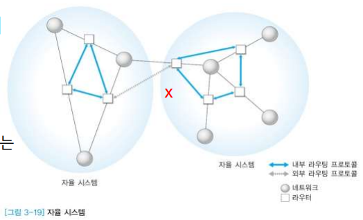

# 3장 3절 인터네트워킹 4절 QoS

### 목표

- 네트워크 연동을 위한 인터네트워킹 기술 이해
- 네트워크 서비스 품질 개요 살펴보기

## 인터네트워킹 개요

- 인터네트워킹

  - 둘 이상의 네트워크를 연결하는 기능 (네트워크와 네트워크 사이를 묶는 개념)
  - 네트워크 차이를 분석하여 전송 데이터를 적절히 중계

- 게이트웨이(gateway)

  - 크게 2가지로 지칭
    - 일반적인 용어 (일반적인 네트워킹)
    - 네트워크 계층보다 상위계층까지 포함하는 경우

- 라우터(router)

  - 네트워크를 연결하는 장비이며, 일반적으로 계층 3 기능을 수행

    ❗네트워크 계층에서 꼭 나와야 할 단어 : 

    - addressing
    - routing(주소를 보고 어디로 갈지 길을 결정하는 개념)

- 브리지(bridge)

  - 데이터링크 계층
  - 목적지의 주소가 같은 네트워크에 속한 경우 아무런 행동도 하지 않음
  - 서로 다른 네트워크에 해당하면 중계 기능 수행

- 리피터(repeater)

  - 비트 신호 증폭
  - 신호와 잡음이 같이 커져서 리피팅으로 해결하는데 제약이 있음

  

## 브리지

- 좌우에 위치하는 LAN이 같은 종류인 경우
  - 프레임 헤더 해석 후 중계
- 좌우에 위치하는 LAN이 다른 종류인 경우(복잡)
  - 프레임 해석, 변환 필요
  - LAN 1의 헤더 해석 후 제거하고, LAN 2 헤더를 붙여 중계
- 연결되는 LAN의 종류만큼 MAC 계층과 물리계층을 해석할 수 있어야 함

LAN1, LAN2에 같은 기술이 있다고 하면 그대로 전달됨. 만약 기술이 다르다면 브리지는 양쪽 기술에 대한 해석 능력을 모두 갖고 있어야 함. 

- 동작 방식에 따른 분류

  - 트랜스페런트(Transparent) 브리지
    - 사용자에게 투명(사용자는 굳이 의식할 필요 없음)
      - 송신 호스트는 경로에 관한 내용을 알 필요가 없고, 브리지가 자동으로 수행
  - 소스 라우팅(Source routing) 브리지
    - 송신 호스트가 수신 호스트에 이르는 경로 정보를 제공

- 트랜스페런트 브리지

  - 임의의 LAN으로부터 프레임이 도착하는 경우

    - 수신호스트가 송신호스트와 동일한 방향인 경우
      - 무시
    - 수신호스트가 송신호스트와 다른 방향인 경우
      - 중계

  - 각 호스트가 어느 방향에 있는지 알아야 함

  - 동작 예(B1)

    - a -> b : 무시
    - a -> c : 포트 2로 중개
    - a -> e : 포트 3으로 중개

    

    B1 입장에서는 3번 포트 뒤 바로 묶여있는지, 다른 브리지 건너있는지 알 길이 없음.

    

  - 라우팅 테이블

    - LAN이 동작하면서 자동으로 생성
    - 초기화되는 경우(정보가 없을 때)
      - 플러딩(flooding) 사용
        - 프레임이 들어온 포트를 제외한 다른 모든 포트로 전달
    - 들어온 프레임의 송신 주소를 바탕으로 특정 주소가 어떤 포트 뒤에 있는지 학습
      - 역방향 학습(Backward Learning)
    - 호스트 위치가 변동되는 경우 최근 정보로 수정 필요

    

  - 스패닝(spanning) 트리

    - 네트워크에 이중 경로가 존재하는 경우 잘못된 라우팅 정보를 얻을 수 있음

    

    - 이중 경로가 존재하지 않도록 네트워크를 설계해야 함
    - 이중 경로가 존재하는 경우 논리적 연결 상태를 **비순환 형태**로 구성
    - 최상위 브리지를 루트로 설정하고, 다른 브리지에 이르는 최단 경로 트리 구성

  - CSMA/CD 방식과 토큰 버스 방식에서 사용

  - 사용자 입장에서는 간편하나, 비효율적일 수 있음 => 차라리 스패닝 트리 형식으로 구성하는 게 나을수도

- 소스 라우팅 브리지

  - 일반적으로 링 구조 네트워크에서 사용
  - 프레임이 수신 호스트까지 도달하기 위한 라우팅 정보(수신 호스트까지 어디어디를 거쳐가야할지)를 송신 호스트가 제공 -> 브리지는 그에 따라 진행을 함

  

## IP 인터네트워킹

- 요즘은 보안이 강화된 텔넷 서비스 사용함. 

- 라우터에 여러 망 묶일 수 있음.

- 라우터A가 하는 일: 헤더를 읽어내서 처리한 후 헤더를 떼어내 IP계층까지 올라와서 경로 어디로 갈지 판단한 다음 PPP로 가야하는 한다면 PPP 헤더를 붙여서 전달함.

- 각 라우터의 기능
  - 라우터 A
    - 이더넷과 PPP 지원
    - 이더넷 헤더 제거 후 PPP 헤더로 변환
  - 라우더 B
    - PPP와 ATM 지원
    - PPP 헤더 제거 후 ATM 헤더로 변환
- 고정(Fixed) 경로 배정
  - 송신호스트와 수신 호스트 사이에 영구 불변의 경로 배정(길이 딱 하나로 정해짐)
  - 송수신 호스트 사이의 트래픽을 측정(예측)하여 적절히 배정 필요
  - 장점
    - 간단한 구현으로 효과적인 경로 설정 가능
  - 단점
    - 전송 경로가 고정되어 트래픽 변화에 따른 동적 경로 배정 불가능(막혀도 무조건 그 길로 가야 함)

## 인터넷 라우팅

다른 길도 있을 수 있지만 위 예시처럼 설정된 것.

- 적응(Adaptive) 경로배정

  - 인터넷 연결 상태가 변하면 이를 전달경로에 반영
    - 특정 네트워크나 라우터가 정상적으로 동작하지 않는 경우
    - 네트워크 특정 위치에서 혼잡이 발생한 경우
  - 단점
    - 경로 결정 과정이 복잡, 이를 처리하는 라우터 부담 증가
    - 네트워크 변화를 모든 라우터에 동시에 반영하기는 불가능(정보의 불일치(inconsistency) 발생 가능)
    - ex. 전국에 사고나 복구 소식 동시에 알리듯 하기 안됨

- 자율(Autonomous) 시스템

  - 다수의 라우터로 구성되며, 공통의 라우팅 프로토콜을 사용하여 정보 교환
  - 동일한 라우팅 특성에 의해 동작하는 논리적인 단일 구성체
  - 내부(Interior) 라우팅 프로토콜
    - 자율 시스템 내부에서 사용하는 공통 프로토콜
    - **RIP(Routing Information Protocol)**
    - **OSPF(Open Shortest Path First)**

- 외부(Exterior) 라우팅 프로토콜

  - 자율 시스템간 사용하는 라우팅 프로토콜
  - 대표적 프로토콜 : BGP(Border Gateway Protocol)

  

## QoS 개요

- 네트워크의 품질
  - 데이터를 어느 정도 신뢰할 수 있게 전송하는지
  - 데이터 분실, 지연 값의 일관성 등을 기준으로 판단 가능
  - 다양한 서비스가 있으므로 한마디로 규정하기가 어려움
- 서비스 등급
  - 좀더 세부적으로 분류
- 연결 설정 지연(Connection establishment delay)
  - 연결 설정을 위한 처음 Request 발생과 Confirm 도착 사이의 경과 시간
  - 연결 해제에도 동일한 기준 적용 가능
- 연결 설정 실패 확률(Connection establishment failure probability)
  - 임의의 최대연결설정시간을 기준으로 연결이 설정되지 않을 확률
  - 연결 해제에도 동일한 기준 적용 가능
- 전송률(Throughput)
  - 임의의 시간 구간에서 초당 전송할 수 있는 바이트 수
  - 양방향이 다를 수 있음
- 전송 지연(Transit delay)
  - 송신 호스트가 전송한 데이터가 수신 호스트에 도착할 때까지 경과한 시간
  - 망이 복잡하면 늦게 들어옴
- 전송 오류율(Residual error rate)
  - 임의의 시간 구간에서 전송된 총 데이터 수와 오류 발생 데이터 수의 비율
- 우선 순위(Priority)
  - 다른 연결보다 우선해서 처리되는지 여부 

## 인터넷에서의 QoS

- IP 프로토콜에선 모든 패킷에 동일한 기준 적용해서 목적지까지 중개
- Best-effort(최선) : 무조건 좋다는 것 아님, 최선!
- 도착 순서나 데이터의 100% 수신을 보장하지 않음 -> 버퍼 운용 필요
  - 실시간 서비스 제공하고자 할 때
- 전송 데이터의 분류
  - 영상 데이터
    - 실시간 전송이 필요하지만 오류에는 관대
  - 일반 데이터 파일
    - 실시간 전송은 필요 없지만 오류엔 민감
- IP 프로토콜에서 QoS를 지원하기 위해서
  - 각 패킷을 서로 다른 기준으로 구분이 가능해야
  - 라우터에서 처리가 가능해야
  - 사용 조건에 따른 패킷의 구분과 자원 할당