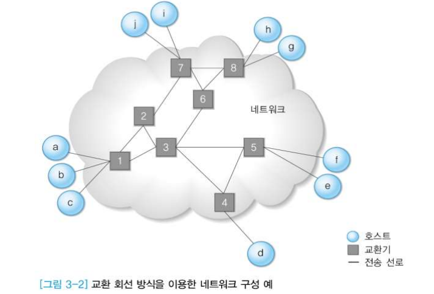
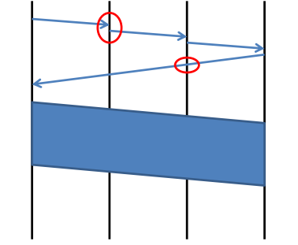
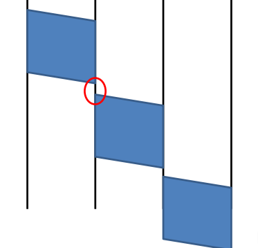
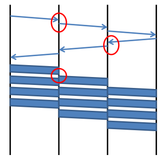
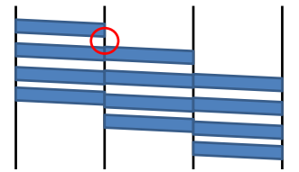
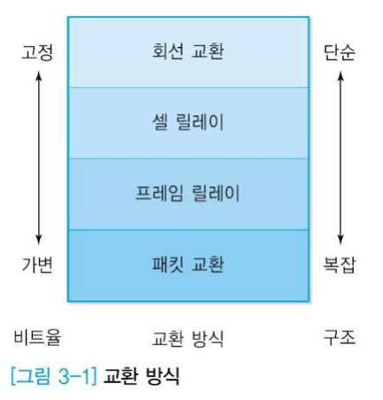
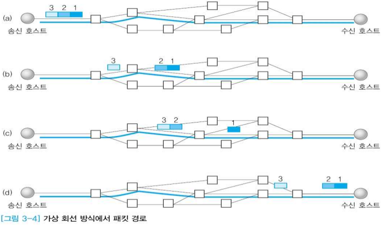
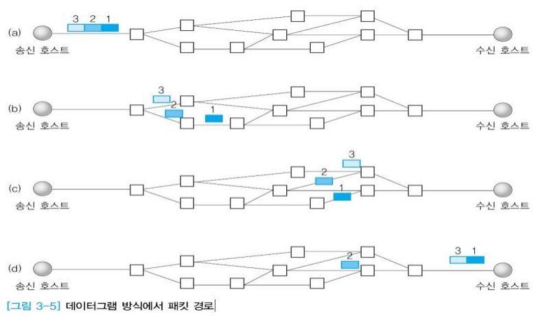
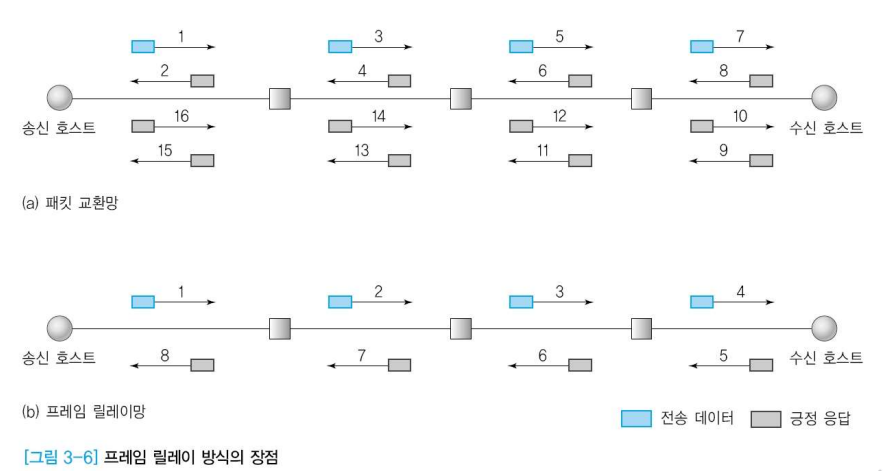

# 3장 1절 교환시스템

### 목표

- 회선 교환 시스템과 패킷 교환 시스템의 차이와 원리 이해
- 가상 회선과 데이터그램의 차이와 원리 이해
- 프레임 릴레이와 셀 교환 방식 이해

## 교환시스템의 종류

- 교환방식을 이용한 네트워크 구성

호스트 : 연산할 수 있는 능력 있음, 컴퓨터로 생각하면 됨

교환기 : 스위칭하는 장비/노드

전송 선로 : 길

- 회선 교환(Circuit Switching)

  - 연결 설정 및 해제 과정 필요

  

  어떤 중계노드로 갈 것인가 판단해서 앞으로 계속 데이터 보낼테니까 너도 준비해달라고 요청 메시지(신호)를 갈 곳에 보냄. 

  사이 간격은 도착해서 어디로 갈건지 연산하는데 필요한 시간 나타냄.

  목적지까지 간 후, 연결이 이제 설정됐다는 신호가 날라갈 때는 다이렉트로 날라감. 쌍방향으로 스위치가 연결되었기 때문.

  연결해제시, 어느 한 방향으로 연결해제 요청이 가면 중간에 중계노드들은 관련된 스위치 연결을 끊고 관련 데이터들을 없앰.

  

- 메시지 교환(Message Switching)

  - 저장 및 전달(Store and Forward)

  

  출발지에서 목적지까지 가는 과정에서 연결설정과정이 없이 다음 노드를 선택한 다음 전체 메시지를 다음 노드에 보내 저장함. 메시지가 다 받아지면 그때 어디로 갈건지 정함.

  

**❗회선 교환과 메시지 교환 차이** :

회선 교환은 맨 앞단에 연결설정하는 과정이 필요함. 메시지 교환은 연결설정과정이 없음.

- 패킷 교환(Packet Switching)

  - 패킷이라는 일정한 크기로 교환

  - 보낼 데이터가 많으면 패킷으로 잘라서 보내는 것

  - 종류

    - 가상회선(Virtual Circuit)

      - 연결 설정 및 해제 과정 필요
      - 서킷 스위칭을 흉내냄

      

      물리적인 스위치가 연결된 것이 아니라, 중간에 컴퓨터가 있다고 생각하면 됨. 

      포트를 보고(등록된 정보를 바탕으로) 어디에 보낼지 결정.

      앞서서 받은 데이터를 보내면서 동시에 데이터를 받기 가능.

      위 원 안의 간격과 아래 원 안의 간격 비교해보면 아래가 더 작음. 위에서 이미 어디로 갈지 결정했으므로. 회선에 대한 정보가 있는 상태!

    - 데이터그램(Datagram)
  
      - 패킷 단위로 교환
      - 메시지 스위칭을 흉내냄

      

      데이터그램은 연결 설정 과정이 없음.

      패킷단위로 데이터를 보내고 봄. 

      위 그림은 보낼 때 어디로 보낼지 고민을 꽤 하는 상태. 패킷이 들어올때마다 매번 고민해야 함.

      어디로 보낼지 고민하는 동안 새로운 패킷이 올 수도 있음.

      데이터그램은 다른 길을 택해서 갈 수도 있음.

  - 장점
  
    - 전송 대역의 효율적인 사용
      - 전송대역의 공유
      - 서킷스위칭으로 연결되는 순간, 다른 사용자의 선로를 쓰고 싶어도 끊어버리면 그 선로 쓸 수 없음.(독점적) 반면, 패킷스위칭은 패킷이 있으면 보냄.
    - 호스트의 무제한 수용
      - 고정대역이 아니므로 이론적으로 무한 수용 가능
      - 통계적 방법 
      - 같이 나눠쓸 수 있음
    - 패킷에 우선순위 부여 가능

  - 단점
  
    - 전송지연이 큼 
      - 내부 버퍼 보관, 기타 큐 관리, 연산 과정 => 해야 할 연산이 많음.
    - 패킷 별로 전송지연이 가변적으로 발생 
      - 망이 복잡하면 전송이 들쑥날쑥할 수 있음
      - 지터(jitter) : 가변 전송지연의 분포
      - 전송지연에 민감한 응용 - 실시간 멀티미디어 전송 
        - 어떤 건 빨리, 어떤 건 늦게 오면 사용자가 수용을 제대로 못하는 상황 발생

## 교환(Switching)

- 교환방식 개요

  - 회선 교환(Circuit Switching)
    - 하드웨어적인 교환
    - 고정 대역 할당
    - 안정적인 전송률
    - 독점적으로 쓰므로 고정적이고 안정적으로 쓸 수 있음
  - 패킷 교환(Packet Switching)
    - 패킷 단위로 나누어 전송하는 겨우 패킷을 기준으로 교환
    - 가변 크기의 전송률
    - 종류
      - 가상회선(Virtual Circuit)
      - 데이터그램(Datagram)

  

  - 패킷 교환

    - 가상회선

    

    중간에 있는 중계노드들이 송신호스트에서 수신호스트로 뭔가가 전달되어하는구나를 알고 준비함.

    123으로 보내면 도착 순서도 123.

  - 데이터그램

  

  가상회선이 없어서 그때그때 판단함.

  보낼 때 123이어도 도착 순서는 예상못함.

## 프레임 릴레이(Frame Relay)

- 등장 배경

  - 이전의 통신 환경에 비해 물리적 전송 오류의 가능성이 줄어듦.

  - 전송계층 프로토콜의 과도한 오류 제어 기능은 낭비적 요소로 작용. 

  - 오류 제어 기능을 축소하여 전송 속도를 향상.(끝단에서 오류제어함)

    

## ATM

- ATM(Asynchronous Transfer Mode)
  - 광역망과 근거리망 양쪽 다 적합함
  - 멀티미디어 통신의 다양한 서비스품질(QoS)를 제공할 수 있음
- 셀 교환
  - 고정된 크기의 패킷 사용
    - Header : 5 bytes, Payload : 48 bytes
    - 하드웨어 교환 가능(패킷스위칭처럼 동작하는데 칩 안에서 수행이 가능하므로)
  - 회선 교환(하드웨어 스위칭, 한번 연결된 후 풀어주기 전까지 다른 사람과 연결 안됨)과 패킷 교환(컴퓨터)의 중간 성격