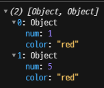
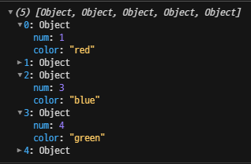
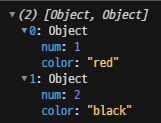
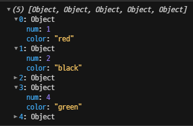

# 배열 내장 함수

> ### 종류
>
> forEach, map. includes, indexOf, findIndex, find, filter, slice, concat, sort, join


1. **forEach**

   ```javascript
   const arr = [1,2,3,4]
   // 방법 1
   for (let i=0; i<arr.length; i++) {
       console.log(arr[i]);
   }
   
   // 방법 2
   arr.forEach((elm) => console.log(elm));
   ```

   두 번째 방법은 콜백함수가 담겨있는 것이라고 생각하면 된다. 즉, 아래와 같은 코드이다.

   ```javascript
   arr.forEach(function (elm) {
       console.log(elm*2);
   });
   ```

   

2. **map**

   ```javascript
   const arr = [1,2,3,4]
   
   // 방법 1
   const newArr = [];
   arr.forEach((elm) => newArr.push(elm*2));
   
   // 방법 2
   const newArr = arr.map((elm) => {
       return elm*2
   })
   ```

   

3. **includes**

   `includes` : 주어진 배열에서 인자로 받은 값이 존재하는지 확인하고, 그 결과를 boolean 형식으로 return한다.

   ```javascript
   const arr = [1,2,3,4]
   let num = 3;
   
   // 방법 1
   arr.forEach((elm) => {
       if (elm === num) {
           console.log(true);
       }
   });
   
   // 방법 2
   console.log(arr.includes(number));
   ```

   

4. **indexOf**

   ```javascript
   const arr = [1,2,3,4]
   let num = 3;
   
   console.log(arr.indexOf(number))
   ```

   [output]

   ```markdown
   2
   ```

   만약 주어진 배열에 인자와 같은 값이 없다면, `-1`을 return한다. 

   

5. **findIndex** : 요소의 인덱스를 반환

   ```javascript
   const arr = [
       {color: "red"},
       {color: "black"},
       {color: "blue"},
       {color: "green"},
       {color: "red"}
   ];
   
   console.log(arr.findIndex((elm) => elm.color === "red"));
   ```

   [output]

   ```markdown
   0
   ```

   `findIndex`는 같은 값 중 순서가 먼저인 요소의 인덱스를 반환한다.

   

6. **find** : 요소를 반환

   ```javascript
   const arr = [
       {color: "red"},
       {color: "black"},
       {color: "blue"},
       {color: "green"},
       {color: "red"}
   ];
   
   console.log(arr.find((elm) => elm.color === "red"));
   
   const element = arr.find((elm) => {
       return elm.color === "blue";
   });
   
   console.log(element)
   ```

   [output]

   ```javascript
   {color: "red"}
   {color: "blue"}
   ```

   

7. **filter** : 전달한 콜백함수가 true를 반환하는 모든 요소를 배열로 반환한다.

   ```javascript
   const arr = [
       {num: 1, color: "red"},
       {num: 2, color: "black"},
       {num: 3, color: "blue"},
       {num: 4, color: "green"},
       {num: 5, color: "red"}
   ];
   
   console.log(arr.filter((elm) => elm.color === "red"));
   ```

   

   

8. **slice** : 배열을 자른다.

   ```javascript
   const arr = [
       {num: 1, color: "red"},
       {num: 2, color: "black"},
       {num: 3, color: "blue"},
       {num: 4, color: "green"},
       {num: 5, color: "red"}
   ];
   ```

   1. ```javascript
      console.log(arr.slice());
      ```

      배열을 그대로 반환한다.

      

      

   2. ```javascript
      console.log(arr.slice(0,2));
      ```

      begin부터 end 전까지 반환한다.

      

      

9. **concat** : 배열을 합친다.

   ```javascript
   const arr1 = [
       {num: 1, color: "red"},
       {num: 2, color: "black"},    
   ];
   
   const arr2 = [
       {num: 3, color: "blue"},
       {num: 4, color: "green"},
       {num: 5, color: "red"}
   ];
   
   console.log(arr1.concat(arr2))
   ```

   

   

10. **sort** : 원본 배열을 정렬한다.

    1. 문자 정렬

       ```javascript
       let chars = ["라", "나", "하"];
       
       chars.sort();
       
       console.log(chars);
       
       ```

       [output]

       ```markdown
       ["나", "라", "하"]
       ```

       

    2. 숫자 정렬

       ```javascript
       let nums = [0,88,3,9,66,8,1];
       
       nums.sort();
       
       console.log(nums);
       
       ```

       [output]

       ```markdown
       [0, 1, 3, 66, 8, 88, 9]
       ```

       숫자 순서대로 정렬되지 않는다. 그 이유는 `sort`는 숫자 기준이 아니라, 문자 기준으로 정렬하기 때문. 즉, 사전순으로 정렬되었다.

       

       ✅**숫자 기준으로 정렬하려면**

       1. 오름차순

          ```javascript
          let nums = [0,88,3,9,66,8,1];
          
          const compare1 = (a,b) => {
              // 1. 크다
              if (a>b) {
                  return 1
          	}
              
              // 2. 작다
              if (a<b) {
                  return -1
          	}
              
              // 3. 같다
              return 0
          }
          
          nums.sort(compare1);
          console.log(nums);
          
          ```

          [output]

          ```markdown
          [0, 1, 3, 8, 9, 66, 88]
          ```

          

       2. 내림차순

          ```javascript
          let nums = [0,88,3,9,66,8,1];
          
          const compare2 = (a,b) => {
              // 1. 크다
              if (a>b) {
                  return -1
          	}
              
              // 2. 작다
              if (a<b) {
                  return 1
          	}
              
              // 3. 같다
              return 0
          }
          
          nums.sort(compare2);
          console.log(nums);
          ```

          [output]

          ```markdown
          [88, 66, 9, 8, 3, 1, 0]
          ```

          

11. **join** : 배열의 요소를 하나의 문자열로 합친다.

    ```javascript
    const arr = ["학교 종이", "땡땡땡", "어서 모이자~", "선생님이", "우리를", "waiting", "하신다."]
    
    console.log(arr.join(" "));
    ```

    [output]

    ```markdown
    학교 종이 땡땡땡 어서 모이자~ 선생님이 우리를 waiting 하신다. 
    ```

    ---
    
    