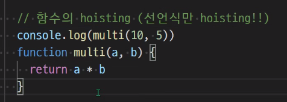
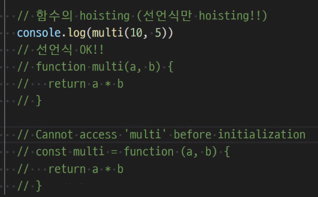
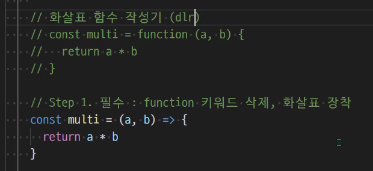
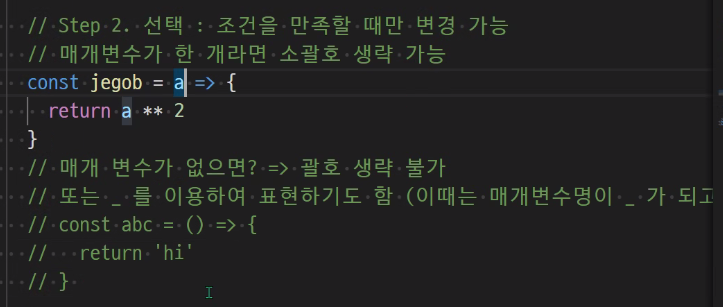
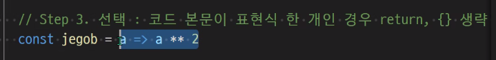
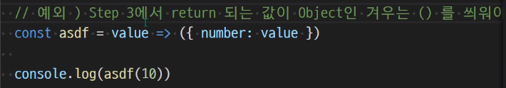

# JavaScript

> ## 필요성
>
> 브라우저 화면을 동적으로 만듦

> ## 브라우저에서 할 수 있는 일
>
> * DOM 조작
>   * 문서 조작
> * BOM 조작
> * JavaScript Core

데이터 타입 종류

특정한 데이터 타입을 가짐

cf. 모를 때는 'mdn' + '찾고자 하는 것' 구글링 

선언식 vs 표현식

Step 1만 필수. 나머지 선택.

