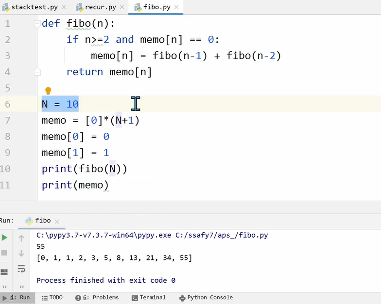

# 자료구조


`프로그램도 일종의 데이터다`


* 스토리지
  * 데이터가 영구히 저장됨
  * 용량 큼
  * 속도 느림
  * 당장 필요한 데이터 아닌, 언젠가 쓸 데이터를 저장함
  
* 메모리
  * 임시적으로 저장
  * 용량 작음
  * 속도 매우 빠름
  * 당장 필요한 데이터가 위치
  * RAM : 각 칸마다 주소값 저장되어있음

* Patriot Missile 오류

* 자료구조 : 컴퓨터의 메모리를 효율적으로 사용할 수 있도록 데이터를 저장하고 구성하는 방법

  * 선형 자료구조
    * list
    * stack
    * linked list
    * queue
  * 비선형 자료구조(얽히고 설킨 구조)
    * graph
    * tree

* ADT(Abstract Data Type) = 구조 + 연산

  * 추상화
    * 개별적 특징 지우고
    * 데이터 구조의 특징 도출
    * 필요한 연산

* Stack(스택) : 자료를 쌓아 올린 형태의 자료구조

  * LIFO(Last-In-First-Out)/ FILO(First-In-Last-Out) : 가장 마지막에 들어간 것이 가장 처음에 나옴

  * 가장 위에서만 데이터의 삽입 & 삭제 발생

  * top : 항상 위쪽(최신) 데이터의 위치

  * pop : 항상 위쪽 데이터를 꺼냄

  * push : 새 데이터 추가

  * peek : 스택 top의 원소를 제거하지 않고 반환

  * empty : 스택이 비었는지 확인

  * recursive function calls

    ```python
    class stack:
        def __init__(self):
            self.items = []
            
        def push(self, val):
            self.items.append(val)
            
        def pop(self):
            try:
                return self.items.pop()
            except IndexError:
                print("Stack is empty")
                
        def top(self):
            try:
                return.self.items[-1]
            except 
    ```

    

* 메모이제이션(memoization)

  


* 탑다운 다이나믹 프로그래밍 : 재귀함수 사용

  ```python
  # 한 번 계산된 결과를 메모이제이션하기 위한 리스트 초기화
  d = [0]*100
  
  # 피보나치 함수를 재귀함수로 구현(탑다운 다이나믹 프로그래밍)
  def fibo(x):
      # 종료 조건(1 혹은 2일 때 1을 반환)
      if x == 1 or x == 2:
          return 1
      # 이미 계산한 적 있는 문제라면 그대로 반환
      if d[x] != 0:
          return d[x]
      # 아직 계산하지 않은 문제라면 점화식에 따라서 피보나치 결과 반환
      d[x] = fibo(x-1) + fibo(x-2)
      return d[x]
  
  print(fibo(99))
  ```

  

* 메모이제이션 동작 분석

  ```python
  # 메모이제이션을 이용할 시, 피보나치 수열 함수의 시간 복잡도는 O(N)
  
  d = [0]*100
  
  def fibo(x):
      print('f(' + str(x) + ')', end=' ')
      if x == 1 or x == 2:
          return 1
      if d[x] != 0:
          return d[x]
      d[x] = fibo(x-1) + fibo(x-2)
      return d[x]
  
  fibo(6)
  
  # 결과 : f(6) f(5) f(4) f(3) f(2) f(1) f(2) f(3) f(4)
  
  ```

  

* 보텀업 다이나믹 프로그래밍 : 재귀함수 x, 반복문 사용함

  ```python
  # 앞서 계산된 결과를 저장하기 위한 DP 테이블 초기화
  d = [0]*100
  
  # 첫번째 피보나치 수와 두번째 피보나치 수는 1
  d[1] = 1
  d[2] = 1
  n = 99
  
  # 피보나치 함수 반복문으로 구현(보텀업 다이나믹 프로그래밍)
  for i in range(3, n+1):
      d[i] = d[i-1] + d[i-2]
  
  print(d[n])
  ```

  

* DP(Dynamic Programming)
  * 메모이제이션을 재귀적 구조에 사용하는 것보다 반복적 구조로 DP를 구현하는 것이 성능 면에서 보다 효율적임.(재귀적 구조의 오버헤드 발생 때문)

* DFS(깊이우선탐색)
  * 비선형구조인 그래프 구조는 모든 자료를 빠짐없이 검색하는 것이 중요
  * 깊이 우선 탐색(DFS)
  * 너비 우선 탐색(BFS)

* 계산기

  * 문자열로 된 계산식이 주어질 때, 스택을 이용하여 게산할 수 있음
  * 문자열 수식 계산의 일반적 방법
    * 중위표기법(infix notation)
    * 후위표기법(postfix notation)

* 백트래킹

  * 막히면 되돌아가서 다시 해를 찾아가는 기법
  * 어떤 노드에서 출발하는 경로가 해결책으로 이어질 것 같지 않으면 더 시상 그 경로를 따라가지 않음 ++> 시도의 횟수를 줄임(prunning 가지치기)
  * 백트래킹 vs 깊이우선탐색
  * 상태 공간 트리

* DFS 알고리즘

  * visited[] & stack[] : list 두 개
  * DFS(시작점) : 변수에 시작점을 넣기
  * visited = [1, 0, 0, 0, 0]  : 1은 방문했다는 표시, 0은 미방문
  * `G[출발][도착] == 1` : 1은 인접정점
  *  `G[출발][도착] == 0` : 0은 인접정점x

* 후위표기법

  * 연산자 : 스택에 쌓기
  * 피연산자 : 출력

  

* [참고] 

  * 부분집합의 합 : 부분집합을 재귀로
  * 순열

* 분할 정복 알고리즘
  * 퀵 정렬
    * 합병정렬은 두 부분으로 나눔
    * 퀵정렬은 분할할 때 기준 아이템 중심으로 작은 것은 왼편, 큰것은 오른편에