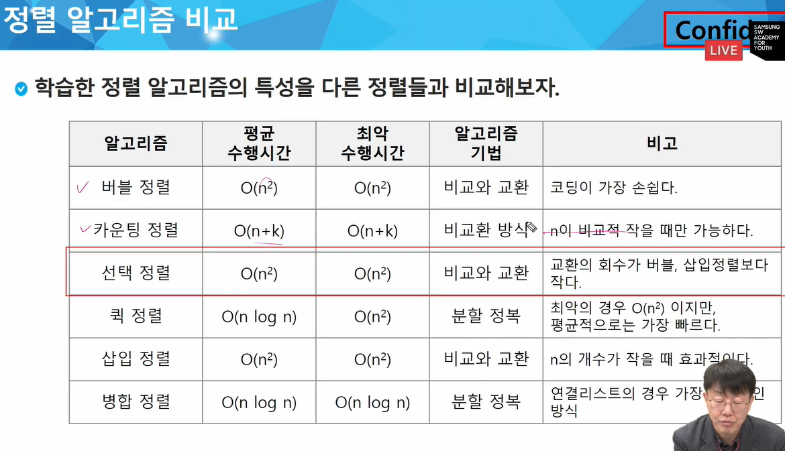

* 차이 주의

`arr = [[0]*3*4`

`arr = [[0]*3 for _ in range(4)]`

* `&` : 둘다(and)
* `|` : 둘 중 하나(or)
* `<<` : 비트 열을 왼쪽으로 이동
* `>>` : 비트 열을 오른쪽으로 이동

* 자료키
* 순차 검색(sequential search)
  * 인덱스와 값을 동시에 조건에 둬서 검사할 때, 인덱스 조건을 값 조건보다 무조건 앞에 둬야함!

* 버블 정렬 & 선택 정렬 암기!!!
* 정렬 알고리즘 비교

