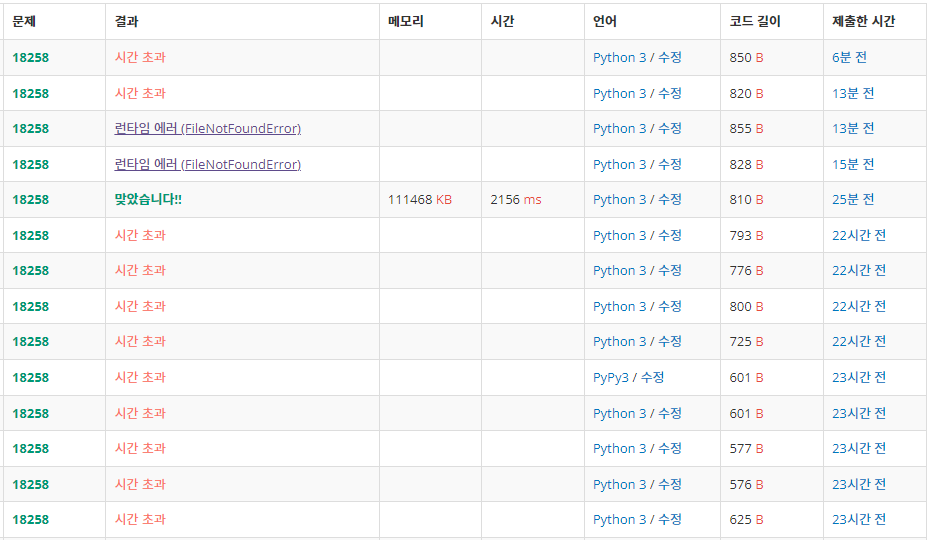

### 🙀시간초과로 애먹은 문제🙀




결국 구글링했다...


```python
# 수정 전

import sys
operations = sys.stdin.readlines()[1:]
q = []
s = ''
for o in operations:
    o = o.rstrip().split()
    if o[0] == 'push':
        q.append(int(o[1]))
    elif o[0] == 'pop':
        if q:
            s += (str(q.pop(0)) + '\n')
        else:
            s += (str(-1) + '\n')
    elif o[0] == 'size':
        s += (str(len(q)) + '\n')
    elif o[0] == 'empty':
        if q:
            s += (str(0) + '\n')
        else:
            s += (str(1) + '\n')
    elif o[0] == 'front':
        if q:
            s += (str(q[0]) + '\n')
        else:
            s += (str(-1) + '\n')
    elif o[0] == 'back':
        if q:
            s += (str(q[-1]) + '\n')
        else:
            s += (str(-1) + '\n')
            
print(s)

```

초기 코드에 비해 수정된 버전이다. 시간 줄이는 방법 구글링해서 다 적용한 것. 하지만 여전히 시간 초과😫


```python
# 수정 후

import sys
input = sys.stdin.readline

testCase = int(input())
queue = []
cnt = 0
for i in range(testCase):
    comm = input().strip()
    if comm.split()[0] =='push':
        queue.append(int(comm.split()[1]))
    elif comm.split()[0]=='pop':
        if len(queue)-cnt ==0:
            print(-1)
        else:
            print(queue[cnt])
            cnt += 1

    elif comm.split()[0]=='size':
        print(len(queue)-cnt)
    elif comm.split()[0] =='empty':
        if len(queue)-cnt ==0:
            print(1)
        else:
            print(0)
    elif comm.split()[0]=='front':
        if len(queue)-cnt ==0:
            print(-1)
        else:
            print(queue[cnt])
    elif comm.split()[0]=='back':
        if len(queue)-cnt==0:
            print(-1)
        else:
            print(queue[-1])
```

내 코드가 아니라 https://j-ungry.tistory.com/187 여기서 가져왔다. 

참고해서 내 코드에 적용시키니 바로 print하는 방법과 변수에 저장 후 마지막에 print하는 방법에서 시간차가 나는 것 같다. 후자로 하면 시간초과된다.
