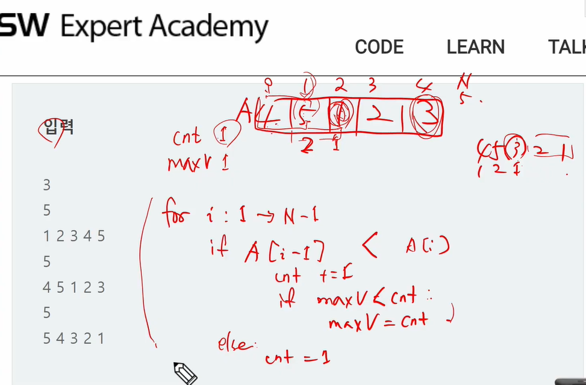
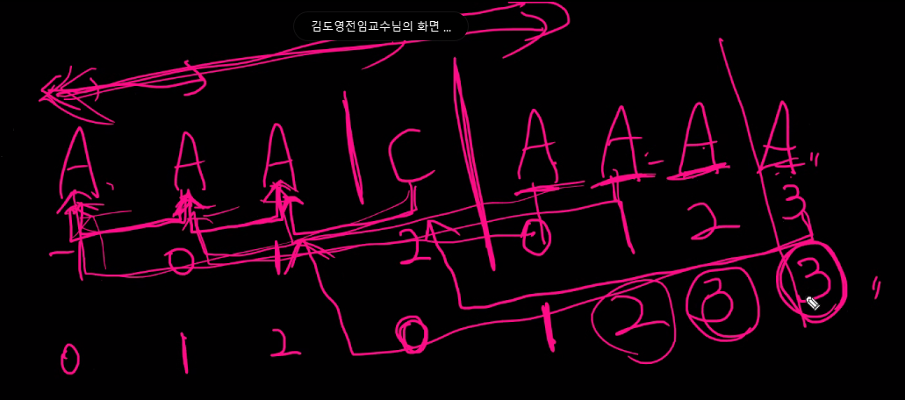

* 아스키코드
* 유니코드
* endian
  * big-endian
  * little-endian
* none vs null
  * none : 정의되지 않은 값
  * null : type이 str. 값이 없음.

* p.22 
  * join()

* kmp

* 패턴매칭에 사용되는 알고리즘
  * KMP
    * LPS 코드 구현해보기
    * 
    * 
    * 
    * 