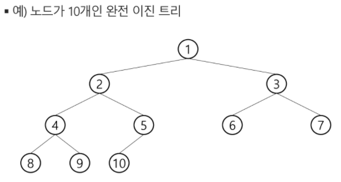

# 트리


## 트리


* 비선형 구조
* 계층형 자료구조
* 노드 : 트리의 원소

  * 최상위 노드 : 루트(root)
  * 정점(node, vertex)
  * 단말노드/잎(leaf) 노드
* 간선(edge) : 노드를 연결하는 선
* 차수(degree)

  * 노드의 차수 : 노드에 연결된 자식 노드의 수
  * 트리의 차수: 트리에 있는 노드의 차수 중 가장 큰 값
  * 단말 노드는 차수가 0
* 높이

  * 노드의 높이 : 루트에서 노드에 이르는 간선의 수
  * 트리의 높이 : 트리에 있는 노드의 높이 중 가장 큰 값/최대 레벨
* 이진트리
  * 모든 노드들이 2 개의 서브트리를 갖는 특별한 형태의 트리
  * 각 노드가 자식 노드를 최대 2 개까지만 가질 수 있음
  * 레벨 i에서 노드의 최대 개수 : 2^i 개
  * 높이가 h인 이진 트리의 최소 노드 개수 : (h+1) 개 / 최대 노드 개수 : (2^(h+1)-1) 개
  

* 포화 이진 트리 (Full Binary Tree)

  * 모든 레벨에 노드가 포화상태
  * 높이가 h일 때, 최대 노드 개수인 (2^(h+1)-1)의 노드를 가진 이진 트리

* 완전 이진 트리 (Complete Binary Tree)

  * 높이가 h이고 노드 수가 n 개일 때, 포화 이진 트리의 노드 번호 1번부터 n번까지 빈 자리가 없는 이진 트리

  

  

* 편향 이진 트리 (Skewed Binary Tree)

  * 높이 h에 대한 최소 개수의 노드(h+1)를 가지면서 한쪽 방향의 자식 노드만을 가진 이진 트리

* 순회 (traversal)

  * 트리의 각 노드를 중복되지 않게 전부 방문하는 것
  * 기본적인 순회방법
    * 전위순회 (preorder traversal) : VLR
      * 부모노드 방문 후, 자식노드 좌,우 순서로 방문
    * 중위순회 (inorder traversal) : LVR
      * 왼쪽 자식노드, 부모노드, 오른쪽 자식노드 순
    * 후위순회 (postorder traversal) : LRV
      * 자식노드를 좌우 순서로 방문 후, 부모노드로 방문

* 배열을 이용한 이진 트리의 표현

  * 노드 번호의 성질

    * 노드 번호가 i인 노드의 부모 노드 번호 : i//2
    * 노드 번호가 i인 노드의 왼쪽 자식 노드 번호 : 2*i
    * 노드 번호가 i인 노드의 오른쪽 자식 노드 번호 : 2*i+1
    * 레벨 n의 노드 번호 시작 번호 : 2^n
    * 노드 번호를 배열의 인덱스로 사용

  * 단점😨

    * 편향 이진 트리의 경우에 사용하지 않는 배열 원소에 대한 메모리 공간 낭비 발생
    * 트리의 중간에 새로운 노드를 삽입하거나 기존의 노드를 삭제할 경우 배열의 크기 변경 어려워 비효율적

  * 단점을 보완하기 위해 연결리스트를 이용하여 트리를 표현

  * 이진 탐색 트리

    * 왼쪽 서브트리 < 루트 노드 < 오른쪽 서브트리
    * 중위 순회하면 오름차순으로 정렬된 값을 얻을 수 있음

    


## 힙


* 완전 이진트리에서


### 삽입

1) 마지막 인덱스 뒤에 인덱스 하나 더 추가 후 숫자 삽입
2) 부모노드와 추가한 값을 비교
3) 최대힙일 경우, 부모노드보다 크면/ 최소힙일 때는 부모노드보다 작으면 => 자리 바꿈 => 반복
4) 비교할 부모 노드가 없으면 자리 확정

* 예시

```python
# 최대 100개의 정수
# 최대힙

def enq(n):
	global last
    last += 1
    tree[last] = n  # 완전이진트리 유지
    c = last        # 새로 추가된 정점을 자식으로
    p = c//2        # 완전이진트리에서의 부모 정점 번호
    # 부모가 있는 상태에서 자식의 키값이 더 크면 교환
    while p >= 1 and tree[p] < tree[c]:    
        tree[p], tree[c] = tree[c], tree[p]
        c = p
        p = c//2

# 포화이진트리의 정점번호
tree = [0]*101
last = 0    # 마지막 정점 번호
enq(3)
enq(2)
enq(4)
enq(7)
enq(5)
enq(1)
print(tree[1])
==> 7

```


### 삭제

* 힙에서는 루트 노드의 원소만을 삭제할 수 있음
* 루트 노드의 원소를 삭제하여 반환함
* 힙의 종류에 따라 최대값 또는 최소값을 구할 수 있음 


최대힙일 경우,

1. 루트 노드의 원소 삭제 but 원소 따로 보관
2. 마지막 노드 삭제, 루트에 마지막 노드의 원소를 복사
3. last(마지막 인덱스) 감소시킴
4. 루트 노드의 자식 노드 중 더 큰 자식과 자리 바꿈 => 반복

* 예시

  ```python
  # 최대 100개의 정수
  # 최대힙
  
  #=== def enq(n) 생략===
  
  def deq(n):
  	global last
      tmp = tree[1]   # 루트의 key값
      tree[1] = tree[last]   # 마지막 정점의 키를 루트에 복사
      last -= 1       # 마지막 정점 삭제
      # 부모 > 자식 규칙 유지
      p = 1
      c = p*2         # 왼쪽자식노드 번호
      while c <= last:       # 왼쪽자식이 있으면
          # 오른쪽 자식노드가 있고 더 크면
          if c+1 <= last and tree[c] < tree[c+1]:
              c += 1         # 오른쪽 자식 선택
          # 자식의 키값이 더 크면 교환
          if tree[p] < tree[c]:
              tree[p], tree[c] = tree[c], tree[p]
              p = c
              c = p*2
          else:
              break
      return tmp            
  
  # 포화이진트리의 정점번호
  tree = [0]*101
  last = 0    # 마지막 정점 번호
  enq(3)
  enq(2)
  enq(4)
  enq(7)
  enq(5)
  enq(1)
  enq(9)
  while last>0:
      print(deq())
      print(tree(1))
  ==> 
  9 7
  7 5
  5 4
  4 3
  3 2
  2 1
  1 1
  ```

  

### 완전이진트리에서의 순회

```python
def pre_order(v):
    global last
    if v <= last: # 마지막 정점번호 이내
        print(v)  # visit(v)
        pre_order(v*2)   # 왼쪽
        pre_order(v*2+1)   # 오른쪽        
```

* 일반트리와 완전이진트리의 차이점 : 일반트리는 일일이 다 가봐야 존재하는지 앎(리스트에 저장된 값을 가져오는 방식). 완전이진트리는 유추가능. 자식노드가 존재하면 반드시 left, right 순으로 존재하므로.

cf. 일반트리에서의 순회

```python
def pre_order(v):
    if v:  # 0번 정점이 없으므로
        print(v)
        pre_order(ch1[v])    # 리스트에 저장된 값을 가져오는 방식
        pre_order(ch2[v])
        
def in_order(v):
    if v:
        in_order(ch1[v])
        print(v)
        in_order(ch2[v])             
```

