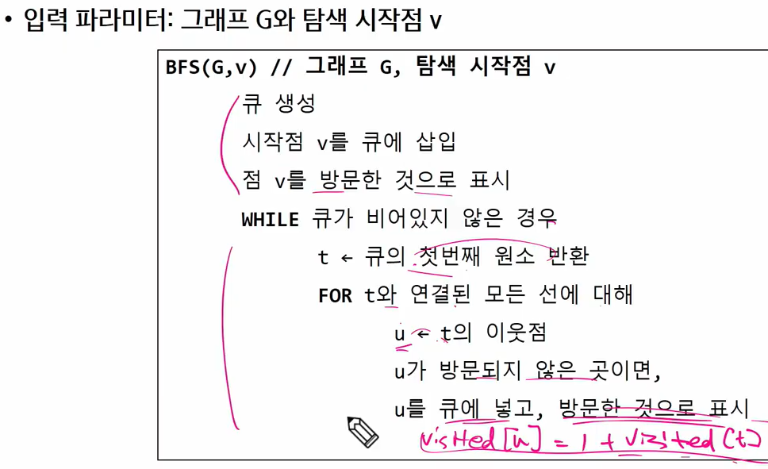
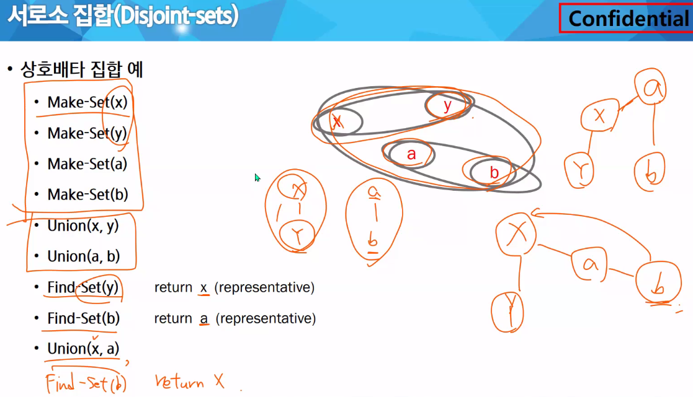
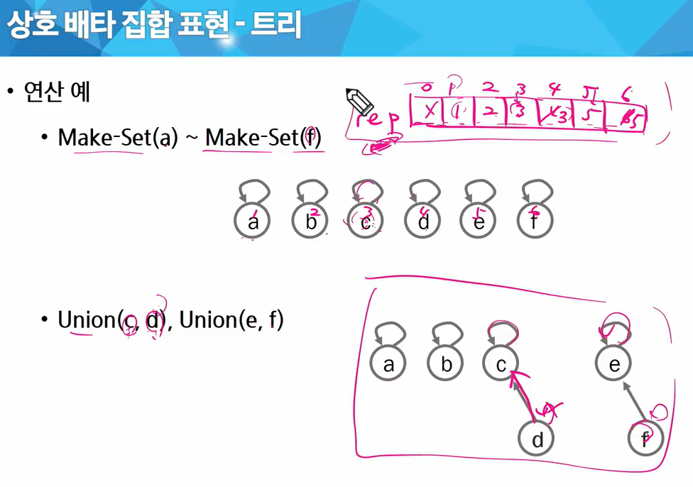
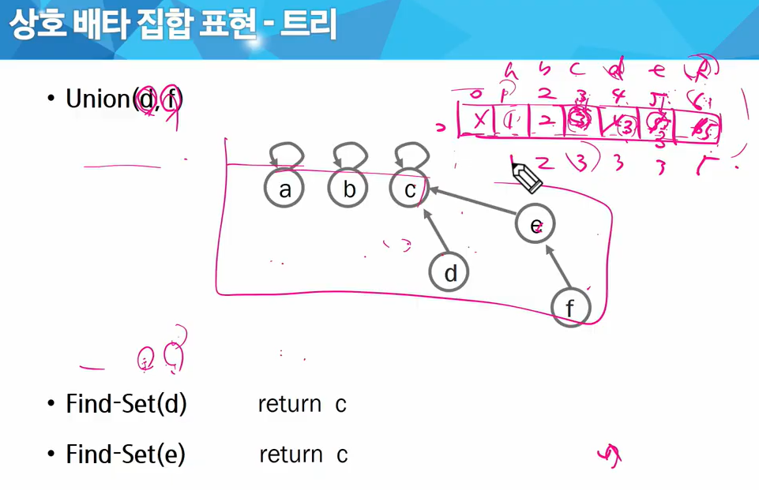
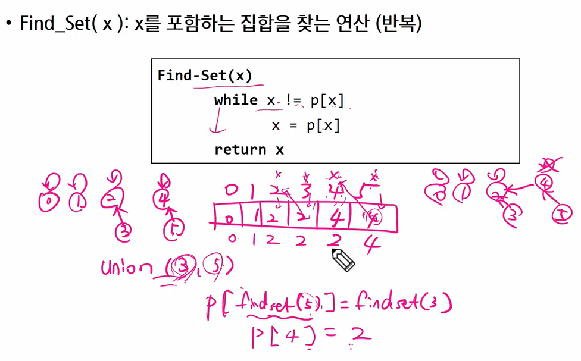

# 그래프


아이템들과 이들 사이의 연결 관계를 표현함

정점들의 집합과 이들을 연결하는 간선들의 집합으로 구성됨

|V| : 정점의 개수 (집합의 크기) , |E| : 그래프에 포함된 간선의 개수 (V : 정점 집합)

|V| 개의 정점을 가지는 그래프는 최대|V|(|V|-1)/2 간선이 가능

ex) 3개 정점이 있는 그래프의 최대 간선 수는 3(=3*2/2) 개

선형 자료구조나 트리 자료구조로 표현하기 어려운 N:N 관계를 가지는 원소들을 표현하기에 용이


## 그래프 유형

* 무향/유향

* 완전 그래프
* 부분 그래프


* 인접 (Adjacency)
  * 두 개의 정점에 간선이 존재하면 "서로 인접해 있다"
* 그래프 경로
  * 경로
    * 간선들 : (1,3), (3, 2), (2, 4), (4, 5)
    * 정점들 : 1-3-2-4-5

  * 단순 경로
  * 사이클


## 그래프 표현


* 간선의 정보를 저장하는 방식, 메모리나 성능을 고려해서 결정


## 인접 행렬


* 무향

* 유향
  * 진출차수
  * 진입차수


```python
# 마지막 정점번호, 간선수
# 6, 8
# 0 1 0 2 0 5 0 6 5 3 4 3 5 4 6 4

V, E = map(int, input().split())
arr = list(map(int, input().split()))
adjM = [[0]*(V+1) for _ in range(V+1)]

for i in range(E):
    n1, n2 = arr[i*2], arr[i*2+1]
    adjM[n1][n2] = 1   # 유향그래프이면 이것 하나만
    adjM[n2][n1] = 1   # 무향그래프인 경우 얘도 있어야 해
```


```python
# 마지막 정점번호, 간선수
# 6, 8
# 0 1 0 2 0 5 0 6 5 3 4 3 5 4 6 4

V, E = map(int, input().split())
arr = list(map(int, input().split()))
adjL = [[] for _ in range(V+1)]

for i in range(E):
    n1, n2 = arr[i*2], arr[i*2+1]
    adjL[n1].append(n2)   # 유향그래프이면 이것 하나만
    adjL[n2].append(n1)   # 무향그래프인 경우 얘도 있어야 해
```


# DFS (Depth First Search)


* 깊이우선탐색

```python
def dfs1(v, V):     # v 방문한 곳  V 정점 개수
    visited[v] = 1  # 방문했다는 표시
    print(v, end = ' ')
    for w in range(V+1):    # w에 인접한 모든 노드에 대해
        if adjM[v][w] and visited[w]==0:   # 인접하고 아직 방문하지 않은 곳이라면
            dfs1(w, V)
            
V, E = map(int, input().split())
arr = list(map(int, input().split()))
adjM = [[0]*(V+1) for _ in range(V+1)]

for i in range(E):
    n1, n2 = arr[i*2], arr[i*2+1]
    adjM[n1][n2] = 1   # 유향그래프이면 이것 하나만
    adjM[n2][n1] = 1   # 무향그래프인 경우 얘도 있어야 해
    
visited = [0]*(V+1)
dfs1(0, V)
```


```python
def dfs2(v, V):
    visited[v] = 1
    print(v, end = ' ')
    for w in adjL[v]:    # v에 인접한 모든 노드 w에 대해
        if visited[w]==0:
            dfs2(w, V)

V, E = map(int, input().split())
arr = list(map(int, input().split()))
adjL = [[] for _ in range(V+1)]    # 인접리스트

for i in range(E):
    n1, n2 = arr[i*2], arr[i*2+1]
    adjL[n1].append(n2)   # 유향그래프이면 이것 하나만
    adjL[n2].append(n1)   # 무향그래프인 경우 얘도 있어야 해
    
visited = [0]*(V+1)
dfs2(0, V)
```

유향일 때는 인접 노드가 없을 때 점프하듯 스택에 저장된 노드로 곧장 갈 수 있음!!!


## BFS (Breadth First Search)


* 너비우선탐색 : 탐색 시작점의 인접한 정점들을 먼저 모두 차례로 방문한 후, 방문했던 정점을 시작점으로 하여 다시 인접한 정점들을 차례로 방문하는 방식


### 큐

front, rear 인덱스를 쓰면 deque보다 속도 빠름





```python
```


## 서로소 집합 (Disjoint-sets)


* 서로소 또는 상호배타 집합들은 서로 중복 포함된 원소가 없는 집합들. 즉, 교집합이 없음

* 집합에 속한 하나의 특정 멤버를 통해 각 집합들을 구분함. 이를 대표자(representative)라 함


* 상호배타 집합 표현 방법
  * 연결 리스트
  * 트리
  
* 상호배타 집합 연산

  * Make-Set(x) : 서로소 요소 생성
  * Find-Set(b) : 부모찾기
  * Union(x, y) 

  


#### 트리

* 하나의 집합을 하나의 트리로
* 자식 노드가 부모 노드를 가리킴. 루트 노드가 대표자가 됨. ex) 자식 인덱스로 부모 노드 저장  



Union(c, d) : d의 대표원소를 c로 변경

Union(e, f) : f의 대표원소를 e로 변경







* rank를 이용한 Union 
  * subtree의 높이를 랭크Rank라는 이름으로 저장
  * 


* path compression


## 최소 신장 트리 (MST)

Minimum Spanning Tree

무방향 가중치 그래프에서 신장 트리를 구성하는 간선들의 가중치의 합이 최소인 신장 트리


* 신장 트리
  * n 개의 정점으로 이루어진 무방향 그래프에서 n 개의 정점과 n-1 개의 간선으로 이루어진 트리
* 그래프에서 최소비용 문제


