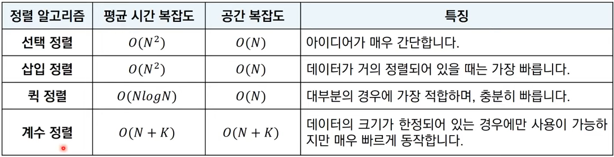
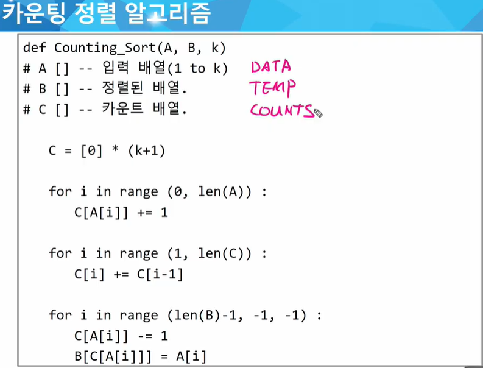
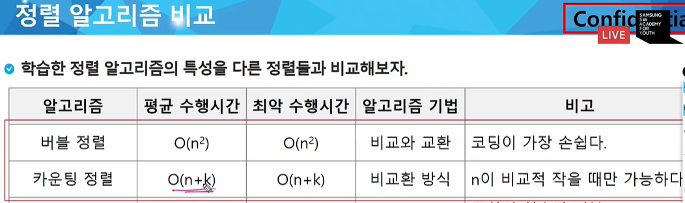

# 정렬

## 선택 정렬 

* 가장 작은 데이터를 선택해 맨 앞에 있는 데이터와 바꾸는 것을 반복
* 시간복잡도 : O(N^2)

* 삽입 정렬

  * 하나씩 골라 적절한 위치에 삽입
  * 일반적으로, 선택정렬보다 더 효율적으로 동작함
  * 시간복잡도 : O(N^2)
    * 현재 리스트의 데이터가 거의 정렬된 상태라면 빠르게 동작함
    * 최선의 경우 O(N)의 시간 복잡도를 가짐

  

## 퀵 정렬

* 기준 데이터 설정 후 기준보다 큰 데이터와 작은 데이터의 위치를 바꿈
* 일반적인 상황에서 가장 많이 사용됨
* 병합 정렬과 함께 대부분의 프로그래밍 언어의 정렬 라이브러리의 근간이 됨
* 가장 기본적인 퀵 정렬은 첫 번째 데이터를 pivot(기준 데이터)로 설정함
* 시간복잡도 : O(NlogN)
  * 최악의 경우(이미 거의 정렬되어있을 때, pivot을 처음이나 마지막 데이터로 둘 때), O(N^2)의 시간복잡도를 가짐.

## 계수 정렬

* 특정한 조건이 부합할 시 사용 가능 but, 매우 빠르게 동작함
  * 데이터의 크기 범위가 제한되어 정수 형태로 표현할 수 있을 때 사용 가능 

* 데이터의 개수가 N, 데이터(양수) 중 최댓값이 K일 때 최악의 경우에도 시간복잡도는 O(N+K)
* 시간복잡도와 공간복잡도 모두 O(N+K)
*  때에 따라서 심각한 비효율성이 발생할 수 있음
  * ex) 0, 100000처럼 차가 큰 데이터가 2개일 때

* 동일한 값을 가지는 데이터가 여러 개 등장할 때 효과적임

## 정리

 

대부분의 프로그래밍 언어에서 지원하는 표준 정렬 라이브러리는 최악의 경우에도 O(NlogN)을 보장하도록 설계되어 있음

(출처 : 동빈나 https://www.youtube.com/watch?v=KGyK-pNvWos)

* 버블 정렬
* 카운팅 정렬
  * stable sort
  * unstable sort

* 정리

* 완전 탐색
* 탐욕(Greedy) 알고리즘

* 참고) 코딩 오류 시, 엣지케이스 관련 오류 多
* continue 다시 공부