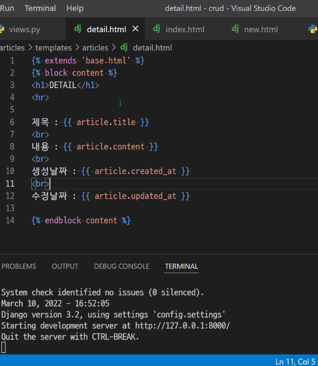

* 정적 웹 페이지
  * 서버에 미리 저장된 파일이 사용자에게 그대로 전달되는 웹 페이지
  * 모든 상황에서 모든 사용자에게 동일한 정보 표시
  * HTML, CSS, JavaScript로 작성됨
* 동적 웹 페이지
  * 웹 페이지에 대한 요청을 받은 경우 서버는 추가적인 처리 과정 이후 클라이언트에게 응답을 보냄
  * 서버 사이드 프로그래밍 언어(Python, Java, C++ 등)가 사용되며 파일을 처리하고 데이터베이스와의 상호작용이 이루어짐

* Framework
  * 프로그래밍에서 특정 운영체제를 위한 응용 프로그램 표준 구조를 구현하는 클래스와 라이브버리 모임

* Django 프로젝트 생성 순서
  1. 가상환경 생성 및 활성화
  2. django 설치
  3. 프로젝트 생성
  4. 서버 켜서 로켓 확인
  5. 앱 생성
  6. 앱 등록

가상환경 생성

프로젝트 생성

BASE_DIR : 시작점을 최상위 폴더로 잡아줌

부등호 사용 못함!

migrate 한 후 가장 먼저 만들 페이지 index

