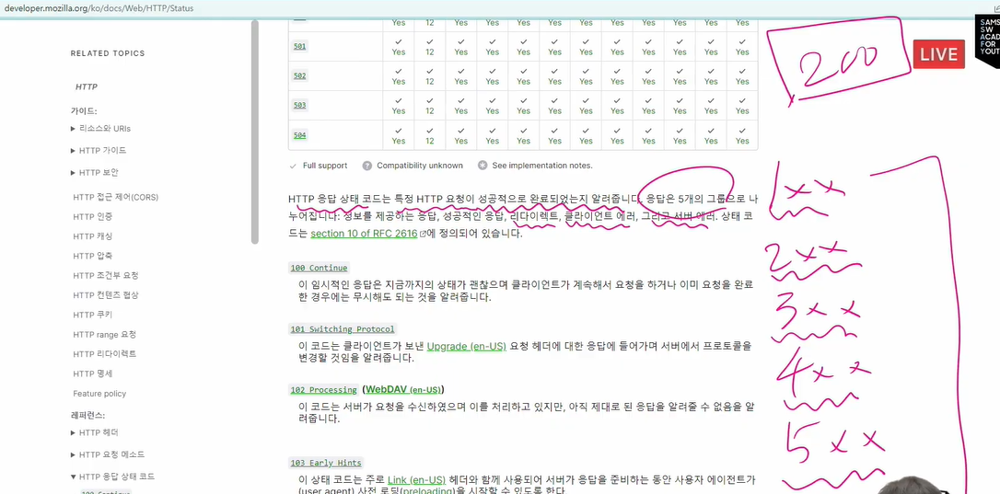
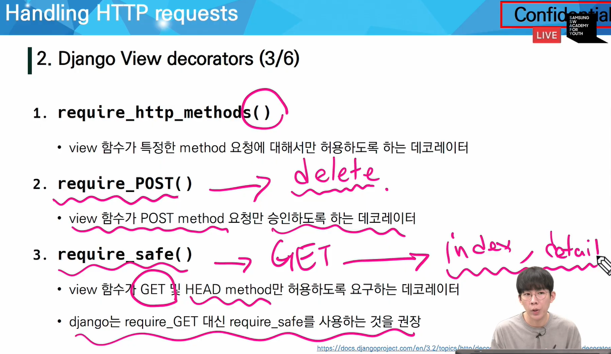
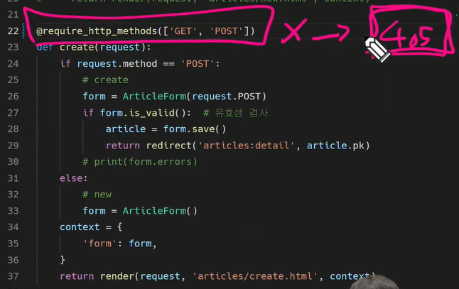
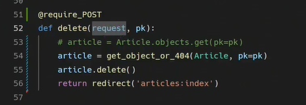

HTTP 응답 상태 코드 : 특정 HTTP 요청이 성공적으로 완료되었는지 알려줍니다.

403 Forbidden : 서버가 클라이언트가 누구인지 알고 있지만, csrf token이 없을 때

404 Not Found :

500 : 정확한 원인을 알 수 없음

None : 값이 없음(값)

null : 비어있음(값x)

MEDIA_URL

업로드된 파일의 주소를 만들어주는 역할

MEDIA_ROOT는 STATIC_ROOT와 다른 경로로 지정해야 함

이미지 업로드 전 이미지가 어디

키워드 인자 순서 : 데이터, 파일, 인스턴스

로그인

* `login(request, user, backend=None)`
  * 현재 세션에 연결하려는 인증된 사용자가 있는 경우 login() 함수가 필요
  * Django의 session framework를 사용하여 세션에 user의 ID를 저장(== 로그인)
  * HttpRequest 객체와 User 객체가 필요
* `get_user()`
  * AuthenticationForm의 인스턴스 메서드
  * user_cache : 인스턴스 생성 시, None으로 할당됨. 유효성 검사를 통과했을 때 로그인한 사용자 객체로 할당됨

로그아웃

* session을 Delete하는 로직과 같음
* `logout(request)`
  * HttpRequest 객체를 인자로 받고 반환값 없음
  * 현재 요청에 대한 seession data를 DB에서 완전히 삭제하고 클라이언트의 쿠키에서도 sessionid가 삭제됨
  * 사용자가 로그인하지 않은 경우 오류를 발생시키지 않음
  * 다른 사람이 동일한 웹 브라우저를 사용하여 로그인하고, 이전 사용자의 세션 데이터에 액세스하는 것을 방지함

로그인 사용자에 대한 접근 제한

* 로그인 사용자에 대한 액세스 제한 2 가지 방법
  * `is_authenticated` attribute
  * `login_required` decorator

* `is_authenticated`
  * User model의 속성 중 하나
  * 사용자가 인증되었는지 여부를 알 수 있는 방법
  * 모든 User 인스턴스에 대해 항상 True인 읽기 전용 속성/ AnonymousUser에 대해서는 항상 False
  * 일반적으로 request.user에서 이 속성을 사용함
  * 단, 권한(permission)과는 관련이 없음. 사용자가 활성화 상태거나 유효한 세션을 가지고 있는지도 확인하지 않음.
  * 로그인, 로그아웃의 출력만 신경쓴 것! 유저가 로그인했는지 여부 모름. 그래서 로그인되어 있음에도 주소창에 로그인 페이지 경로를 치면 접근가능.

* `login_required` decorator

  * 사용자가 로그인되어 있지 않으면, settings.LOGIN_URL에 설정된 문자열 기반 절대 경로로 redirect함

    * LOGIN_URL의 기본값: /accounts/login/
    * app 이름을 accounts로 했던 이유 중 하나

  * 사용자가 로그인되어 있으면 정상적으로 view 함수 실행함

  * 인증 성공 시 사용자가 redirect 되어야 하는 경로는 `next` 라는 쿼리 문자열 매개 변수에 저장됨

    ex) /accounts/login/?next=/articles/create/

* `next` query string parameter
  * 로그인이 정상적으로 진행되면 기본에 요청했던 주소로 redirect 하기 위해 마치 주소를 keep 해주는 것
  * 단, 별도의 처리가 없으면 본인이 view에 설정한 redirect 경로로 이동하게 됨
  * 현재 URL로(next parameter가 있는) 요청을 보내기 위해 accounts/login.html의 action 값 비우기

 

회원가입

회원탈퇴

