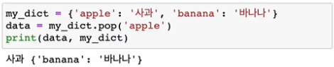

# 자료구조

* 함수와 메서드 비교
  * 함수: 원본 리스트를 정렬 후,
  * 메서드: 원본 리스트는 변경 x, 정렬된 리스트를 return
  * 예시

* .reverse() : 원본 자체를 뒤집음

* 리스트
* 셋 ; 순서 없음

* 딕셔너리

* .pop(key[,default])

  * key가 딕셔너리에 있으면 제거하고 해당 값을 반환/ 그렇지 않으면 default 반환
  * default값이 없으면 KeyError
  * .pop() : 
    * list : 마지막 or index 삭제
    * set : 랜덤(임의의) 삭제
    * dictionary : key 삭제

  * 예시

  

* 메서드 : 문자열에서만 사용가능한 함수

* find(x)와 .index() 비교 :

  값이 없으면 find(x)는  -1 반환, .index()는 오류 발생
  
  

* 깊은 복사 :

mutable한 데이터는 값을 할당할 때 조심! 하나만 변경해도 다른 하나도 같이 변경될 수 있음

* 얕은 복사
