# 함수


## 코드 읽는 순서


```python
# 1 무조건!!!
a = 0
b = 1

# 5
def f1(a,b):
    return a - 2 * b

# 4
def f2(a,b):
    return a + b

# 3
def f3(a,b):
    return f1(a,2) * f2(1,b)

# 2 무조건!!!
result = f3(n1, n2)
print(result)
```


## 함수 기본 구조


```python
# 숫자를 받아서 (input)
# 세제곱 결과를 반환 (output)
# 호출 : cube(2)

def cube(number):
    return number * number * number   # 2

print(cube(2))   # 1
```


## 함수의 결과값 (Output)

* return 안될 때 : None
* return 될 때 : 하나의 값을 반환 (tuple 1 개)


## 함수의 입력 (Input)

* Parameter : 함수 실행할 때, 함수 내부에서 사용되는 식별자 ; 이름

* Argument : 함수 호출할 때, 넣는 값 ; 값

* 예시

  ```python
  def func(car):   # parameter : car
      return car
  
  func('bmw')      # argument : 'bmw'
  ```

  'bmw'


p.35~36

keyword arguments (호출)

Defaul arguments values (정의)


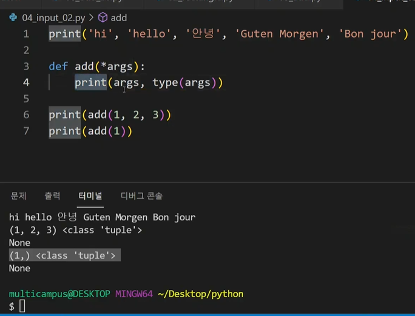


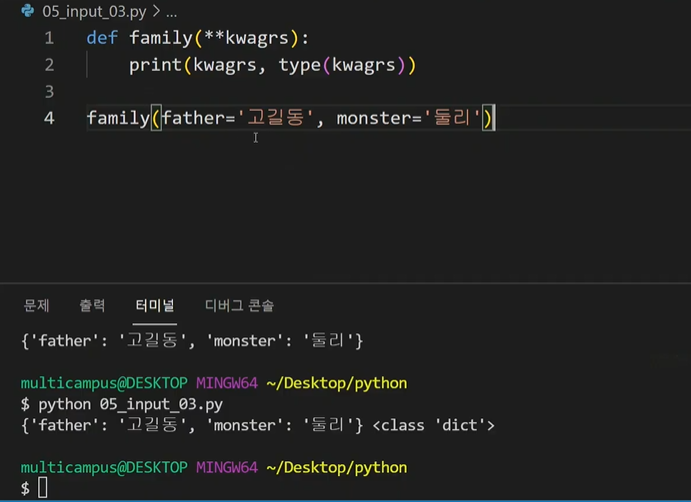

저기서 father와 monster는 식별자


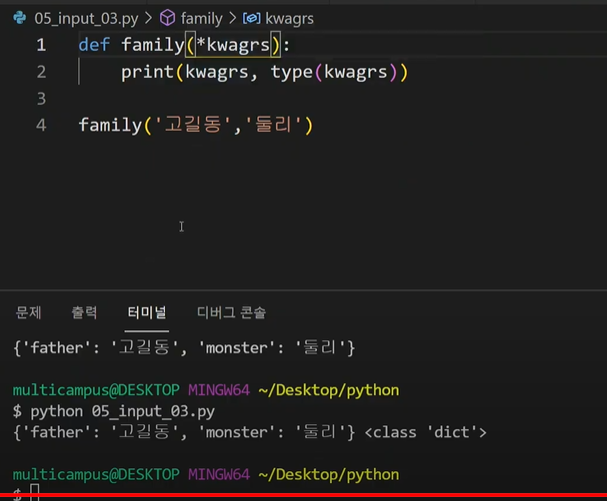


가변(임의) 키워드 인자(Arbitrary Keyword Arguments)

*args

**kwargs


## 정리


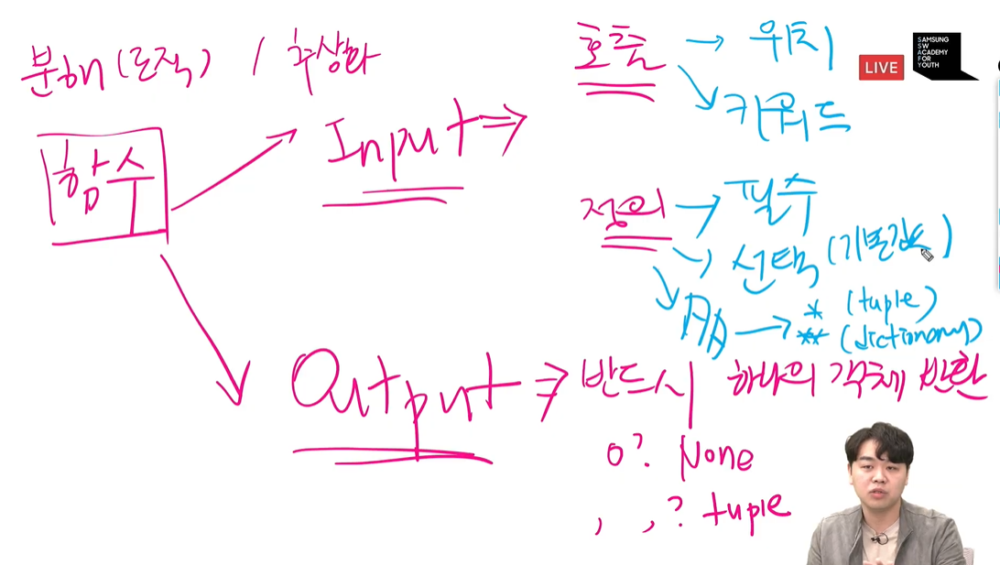


```python
# 함수 선언
def qwer(a, b=1):   # b=1 기본 인자 값 설정

# 함수 호출    
qwer(30)            # a=30, b는 기본 인자 1로 나옴
```


## 함수 범위


함수는 가장 기본 : local scope

블랙박스의 결과를 받고 싶으면 반환 값을 변수에 저장해서 사용하는 것!

블랙박스 밖으로 결과를 주고 싶으면 return해야 함


* 변수 생명주기

빌트인 scope

글로벌 scope  .py일 동안

로컬 scope      return하면 끝


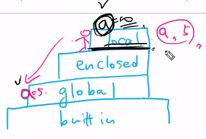


LEGB 순서대로!

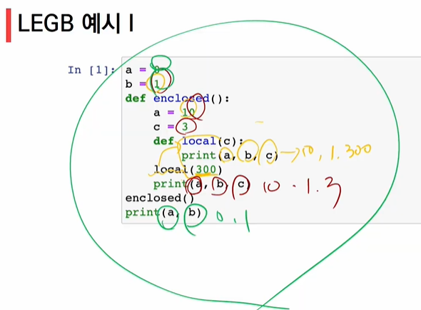

어려워... 다시 보자


nonlocal : global 아님, local아님. 근처에 영향력


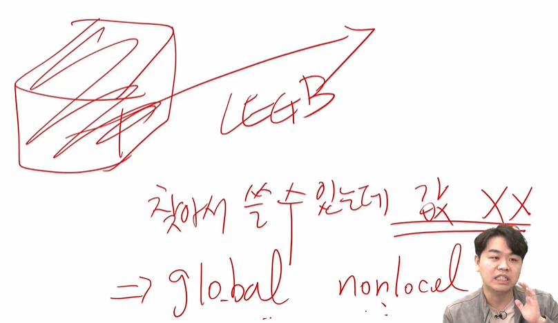

블랙박스에서 이름 찾아가는 과정 : LEGB

이름 찾아서 쓸 수 있지만 값 변경 불가능

단, global, nonlocal 두 개는 값 변경 가능. but 블랙박스라는 개념을 깨게 됨(호출할 때마다 값 변경 가능할 수있다는 위험이 있으므로)


map

map(함수이름, list)

==>  통에 넣고


zip(*iterable)


lambda : 익명함수; 어떤 함수를 잠깐 쓰고 싶을 때

예시)

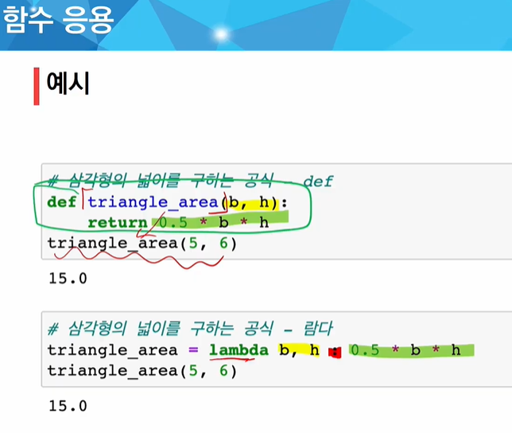


```python
#람다함수 예시
def odd(n):
    return n % 2

print(list(filter(odd, range(5))))
print(list(filter(lambda n: n % 2, range(5))))
```

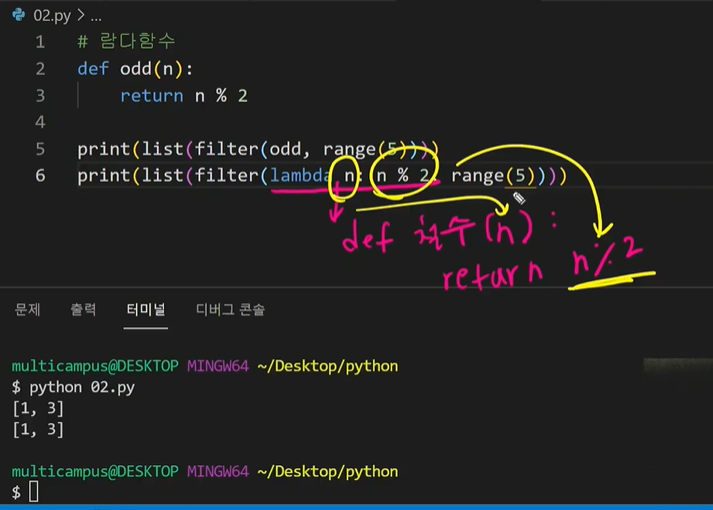


재귀 함수(recursive function)

자기 자신을 호출하는 함수

** 1개 이상의 base case(종료되는 상황)가 존재하고, 수렴하도록 작성 **


filter

return 값이 True/False 구분 가능해야 함


lambda 매개변수 : 표현식


문제풀기

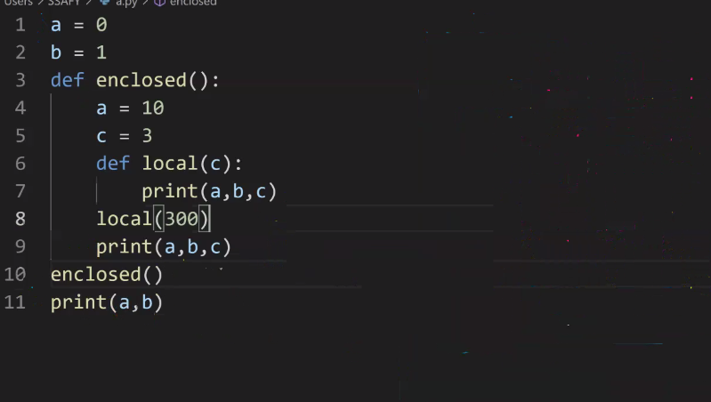


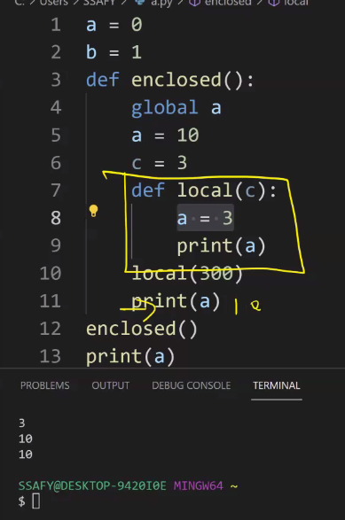


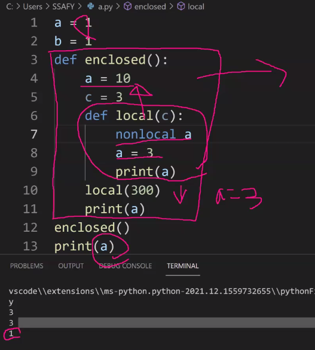


filter


zip


lambda

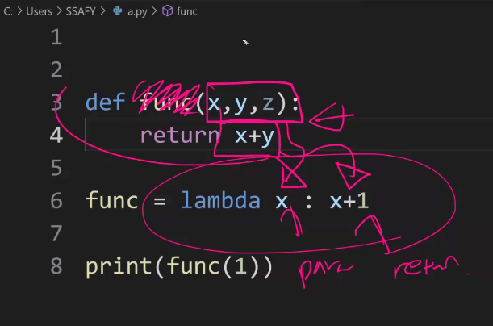


(비교)

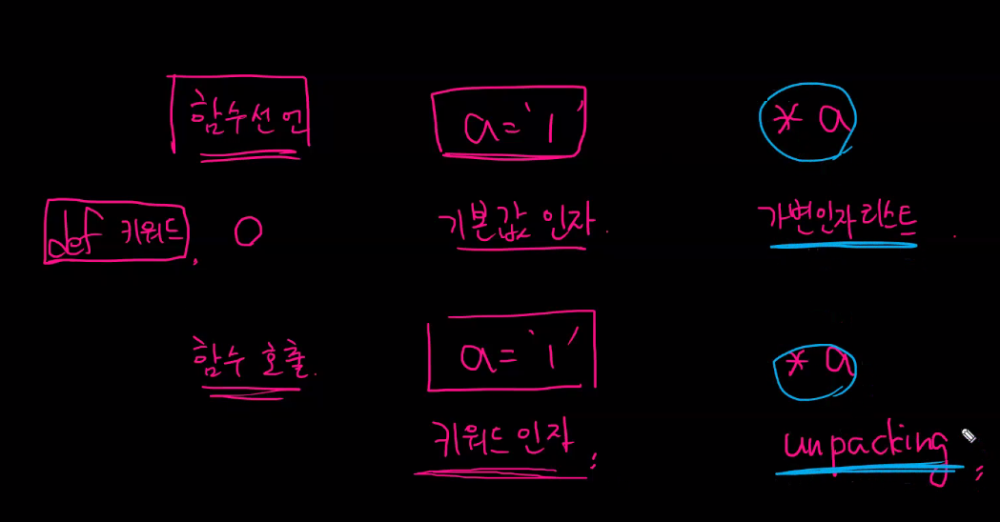


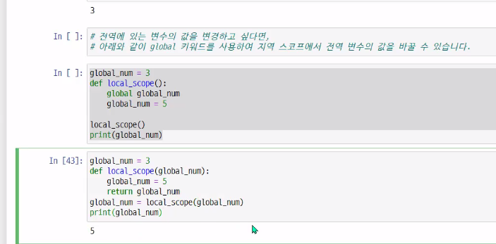


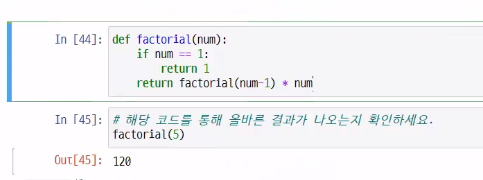


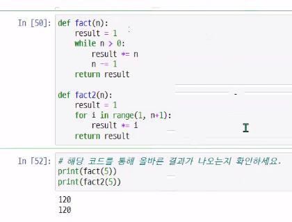

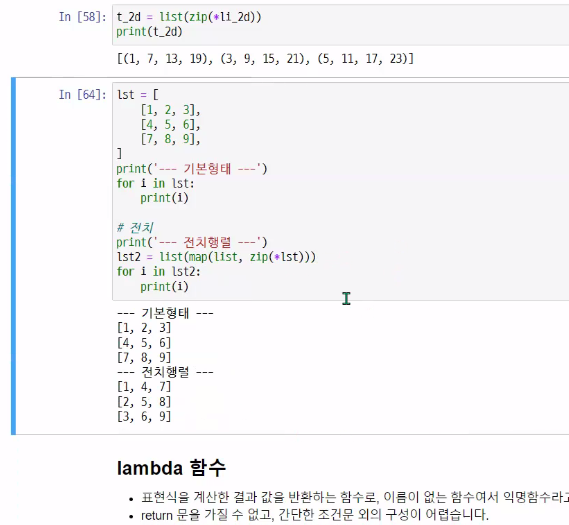
