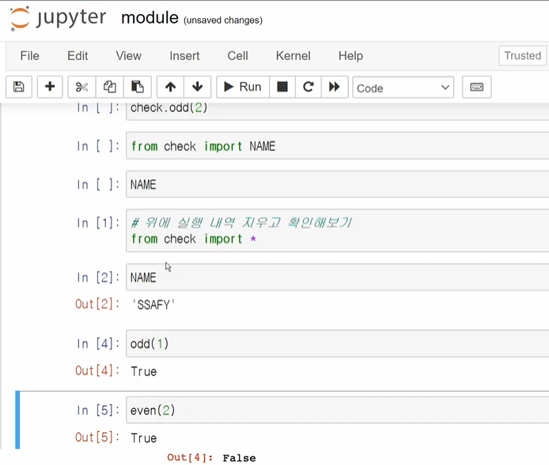
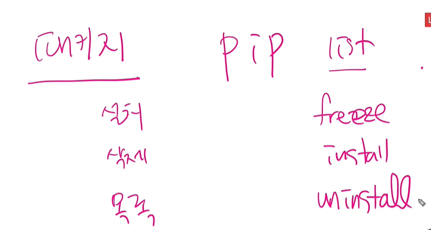

모듈

파이썬 표준 라이브러리(Python Standard Library, PSL)

파이썬 패키지 관리자(pip)

가상환경

* 가상 환경 없이 pip install 명령어로 설치한 패키지들은 전역(글로벌)에 설치됩니다.

* 특정 프로젝트만을 위해 사용할 패키지들을 잘 관리하기 위해 독립된(혹은 고립된) 가상의 공간을 만든다고 보시면 됩니다. 따라서 위에서 질문 주신대로 컴퓨터 전역에 설치된 주피터와 특정 가상 환경에 설치된 주피터는 (버전이 같아도) 다른 패키지가 될 수 있겠지요.

함수 : 모듈 + 패키지

