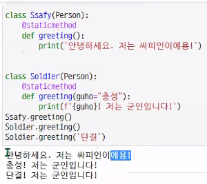

# 객체지향 프로그래밍

* 추상화 : 현실세계를 디지털세계로 옮기는 것

* 예시

  

* 프로그램을 

* 절차지향 프로그래밍 vs 객체지향 프로그래밍

  

`왼쪽 : 절차지향, 오른쪽 : 객체지향` 

* 객체지향은 주어,동사 구조처럼 생각하면 됨

* class : 종류, 틀
  * 클래스 이름 : pascal case 혹은 upper camel case로 씀 

* 인스턴스 : 실제 값, 사용할 수 있는 값

* 속성 : 변수

* 메소드 : 클래스 안 함수

* 객체 비교
  * == : 값, type 확인
  * is : 값, type, id 확인

* 인스턴스 변수
  * 해당 인스턴스.변수명
  * 인스턴스가 개인적으로 가지고 있는 변수

* 인스턴스 메서드
  * 함수, 변수 이름 : snake_case로 씀 
  * 인스턴스 변수를 사용하거나, 인스턴스 변수에 값을 설정
  * self : 인스턴스 자기자신/ 매개변수 이름으로 첫번째 인자로 정의/ 다른 단어로 써도 되지만 암묵적인 규칙/ 호출하는 당사자의 변수가 넘어가서 self가 되는 것!

* 매직 메서드
  * 예시 : `__len__(self)`

* 클래스 변수
  * 클래스명.변수명/ if 인스턴스명.클래스변수명으로 클래스변수에 접근한다면, read_only만. 더 욕심내면 인스턴스 변수로 전환되어 저장
  * 한 클래스의 모든 인스턴스라도 똑같은 값을 가지고 있는 속성

* 클래스 메서드
  * 클래스정보.변수명(cls, arg1, ...) : 이때 self보다는 cls로! self는 인스턴스 메서드 인자로만 쓰기
  * 클래스 변수 접근, 수정할 때
  * @classmethod 데코레이터가 붙어있어야 클래스 메소드

* 스태틱 메서드

  * 인스턴스 변수, 클래스 변수를 전혀 다루지 않는 메서드

  * 속성 다루지 않고, 기능만 함

  * 예시

    

(위에 Person에 대한 클래스 정의가 있음 )

* 메서드 정리

  

  

* 인스턴스와 클래스 간의 이름 공간(namespace)
  * 클래스 : 정의 순간
* static 메서드: 자동으로 넘어가지 않음
* 정리

* 함수 하나당 데코레이터 하나
* 데코레이터 없으면 인스턴스가 첫번째 인자로 전달됨

* 상속
  * 기존에 있던 class를 이용하여 다른 class를 정의
  * class ChildClass(ParentClass):
* isinstance(object, classinfo) : object가 classinfo의 인스턴스이거나 섭클래스면 True 
* issubclass(class, classinfo) : class가 classinfo의 subclass인가를 확인

* 다중 상속
  * 인자가 두 개 이상일 때, 첫번째 인자의 영향을 받음
  * mro 메서드()
    * 메서드 순서 확인
* 다형성
  * 메소드 오버라이딩
    * 상속 받은 메소드를 재정의
  * 참고 ) 오버로딩 (파이썬에서는 지원되지 않음. 연산자에 대한 오버로딩은 지원.) : 같은 이름의 함수를 재정의
  * 메소드 오버라이딩
    * 상속 받은 메소드를 재정의

* 캡슐화
  * getter 메소드 하나만 쓸 수 있지만 setter는 반드시 getter도 있어야 함.

* 중요!!!!!!!!

인스턴스 변수, 인스턴스 메서드, self, 생성자 메서드, 소멸자 메서드,  클래스 변수, 클래스 메서드, (스태틱 메서드), 이름공간, 메서드 정리!!!!!, 상속, super(), 다중 상속, 다형성, 메소드 오버라이딩 => super 다시, 캡슐화 

총 37문제/ 배점 다름/ 100점 만점 중 60점 넘어야 pass/ 1시간/ 4지선다

객관식 25문제

주관식 10문제

서술형 2문제

문제 유형 : 실행결과 유추 多

