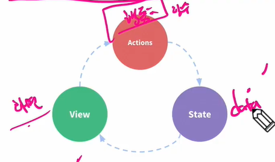

# Vuex

* 상태 관리 패턴 + 라이브러리
* 상태(state)를 전역 
  * 애플리케이션의 모든 컴포넌트

중앙 집중식, 전역에서 관리

> ## 기존 Pass props & Emit event
>
> * 각 컴포넌트는 독립적으로 데이터를 관리
>
> * 데이터의 단방향 흐름 (부모 → 자식)
>
> * 자식에서 부모로 전달할 땐 이벤트를 트리거
>
> * 장점
>
>   * 데이터 흐름을 직관적으로 파악 가능
>
> * 단점
>
>   * 컴포넌트 중첩이 깊어지는 경우 동위 관계의 컴포넌트로의 데이터 전달이 불편해짐 (ex. 동기 간 대화할 수 없는 상태, 위를 거쳐서 전달해야 함)
>
> * state = data, action = methods, view = html
>
>   

> ## Veux management pattern
>
> * 중앙 저장소(store)에 state를 모아놓고 관리 (state == data)
> * 규모가 큰 (컴포넌트 중첩이 깊은) 프로젝트에서 효율적
> * 각 컴포넌트에서는 중앙 집중 저장소의 state만 신경 쓰면 됨
>   * 동일한 state를 공유하는  다른 컴포넌트들도 동기화 됨