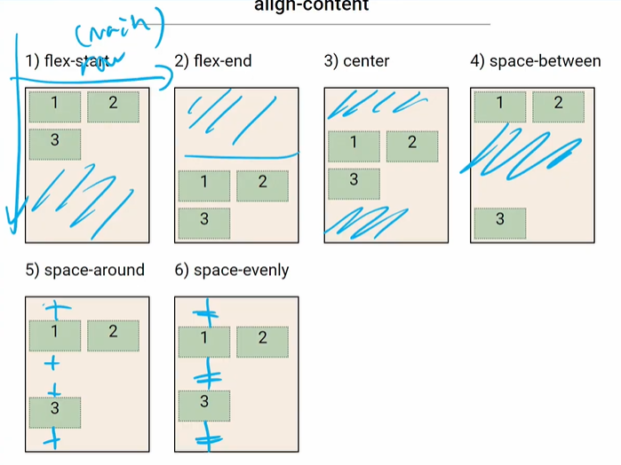
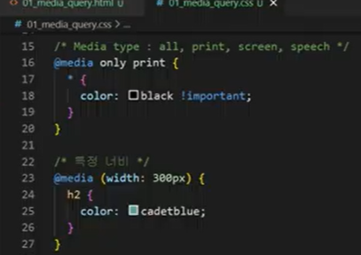
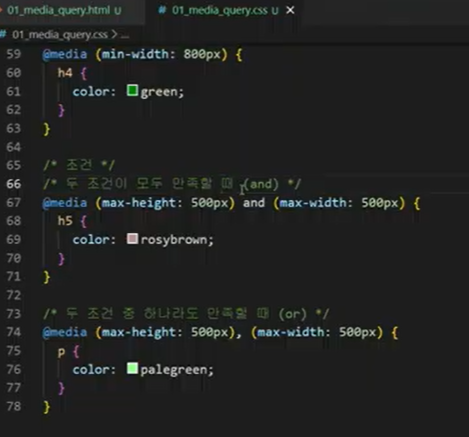
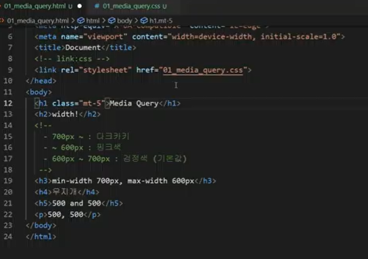
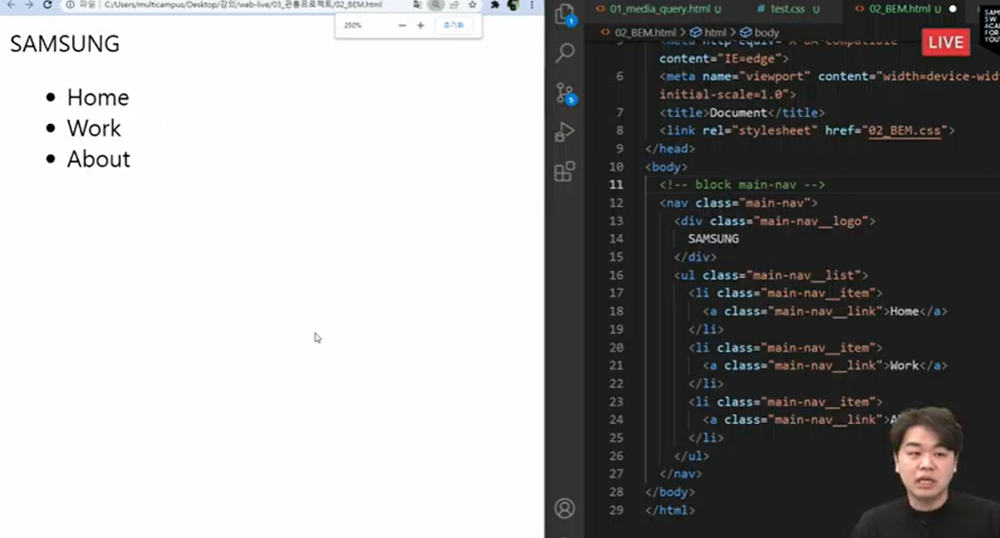
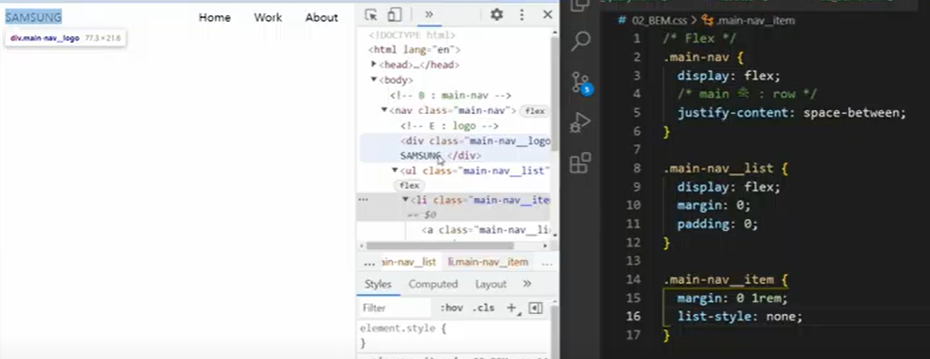
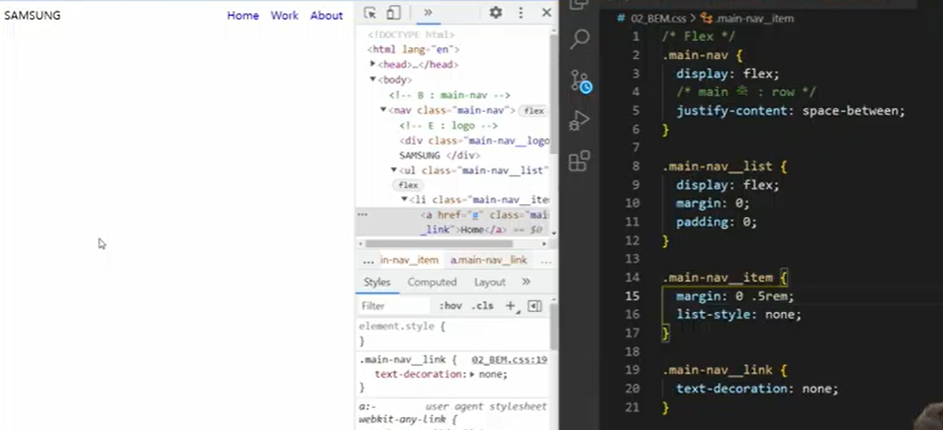
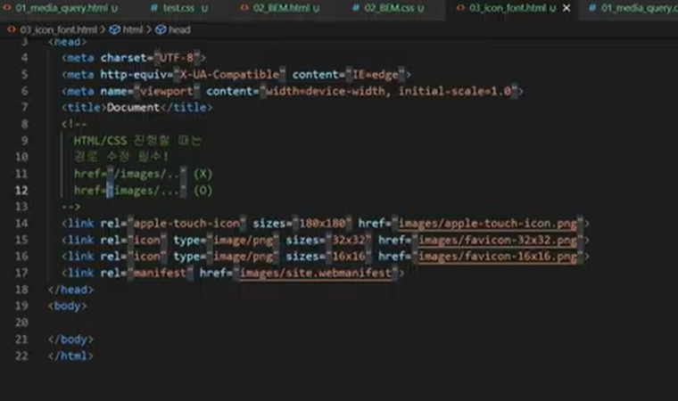
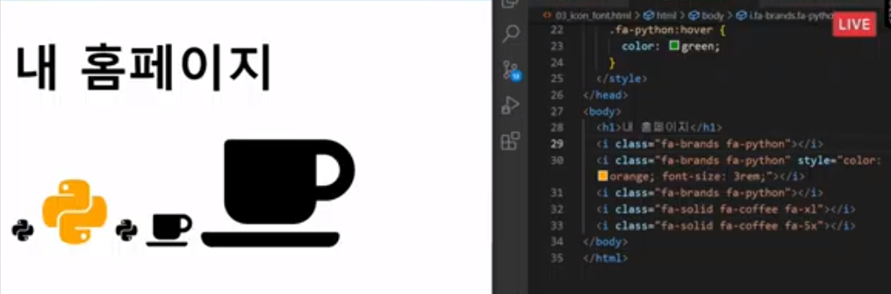
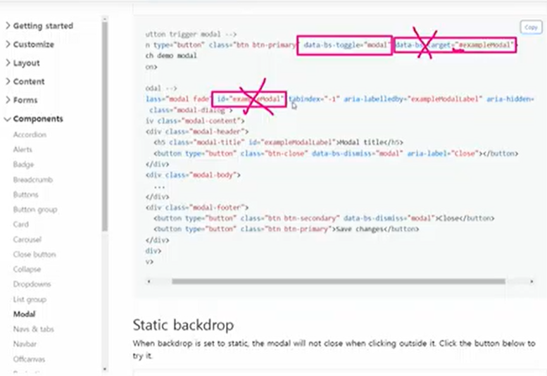

* 참고) 

  * css 원칙
    * inline direction (좌우)
      * span
      * input
      * img
    * Block Direction (상하)
      * div

* Float (시험 문제에 잘 안 나옴)

  * 요소가 Normal Flow에서 벗어나도록 함
  * 인라인요소들이 주변을 wrapping (인라인요소: float된 요소들을 감쌈)
  * none : 기본값
  * left : 요소를 왼쪽으로 띄움
  * right : 요소를 오른쪽으로 띄움
  * 

* 참고) 

  * positioning
    * absolute
    * fixed

  

* Flexbox✨

  * 행과 열 형태로 아이템들을 배치하는 

  * flex-direction

    * Main axis 기준 방향 설정
    * 역방향의 경우, HTML 태그 선언 순서와 시각적으로 다르니 유의 (웹 접근성에 영향)

  * flex-wrap

    * 요소들이 강제로 한 줄에 배치되게 할 것인지 여부 설정
    * wrap : 넘치면 다음 줄에 배치
    * nonwrap : (기본값) 한 줄에 배치

  * justify-content (메인축 기준)

    * flex-start : 남은 영역을 오른쪽에
    * flex-end : 남은 영역을 왼쪽에
    * center : 남은 영역을 양쪽에 (중간 제외)
    * space-between : 컨텐트 사이에 균등하게 남은 공간을 넣어둠
    * space-around : 가질 수 있는 여백을 item들에게 다 나눠줌
    * space-evenly : 빈 공간을 모두 균일하게

  * align-content

    * 
    * flex-start
    * flex-end
    * 

    

  * align-items (align-content보다 多 쓰임)

    * 모든 아이템을 Cross axis 기준으로 정렬

  * align-self

    * 개별 아이템을 Cross axis 기준으로 정렬
    * 주의! 컨테이너에 적용하는 것 X => 개별 아이템에 적용

20220211

* 미디어 쿼리(@media)
  * landscape: 가로모드(너비>높이)
  * portrait: 세로 모드(너비<높이)
  * only print: 프린트모드
  * media type: all, print, screen, speech
  * css 예시
    * 
    * 

* 
  * html예시
    * 
    
  * class naming
    * html
    
    * css
    
    * css
    
    * favicon
    
      
    
    * awesome font
    
    * modal
    
      

​							x친 곳 값 동일해야 함. 네모박스 3 개 반드시 필요!!!

* 
  * as

Web 정리

* HTML

  * DOM
  * 시맨틱 태그
  * 주요 태그와 속성
    * 안나옴 : table, form, input

* CSS

  * 단위(크기, 속성)

  * 선택자 및 우선순위

  * 박스모델

  * 인라인, 블록 요소 특징

  * Position

    * static
    * relative
    * absolute(out of flow)
    * fixed(out of flow)
    * sticky

  * Float : 안나옴

  * Flex

    * align-content : 안나옴
    * axis, container - item
    * 각 속성

    

  ## 반응형 웹

  * Bootstrap
    * grid system
    * breakpoint

## 마크업

* 각 태그별 속성
  * 인라인, 블록
  * `li` => list-style

## 스타일링

### 레이아웃

어떤 display를 가지고 있는지 분석, Box model

* Position
  * 네모 위 네모 => absolute
  * 브라우저 기준 => fixed, sticky

* Flex
* Bootstrap Grid System

### 스타일

* color
* size
* 각 태그별 속성