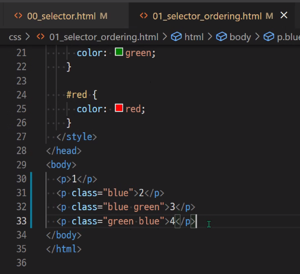
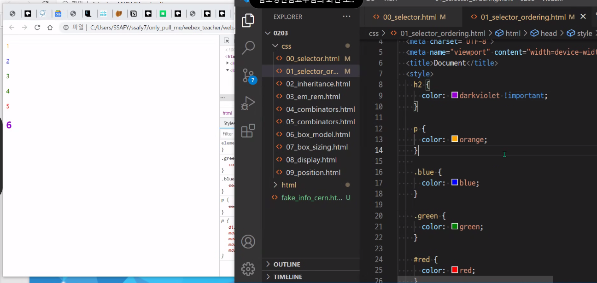
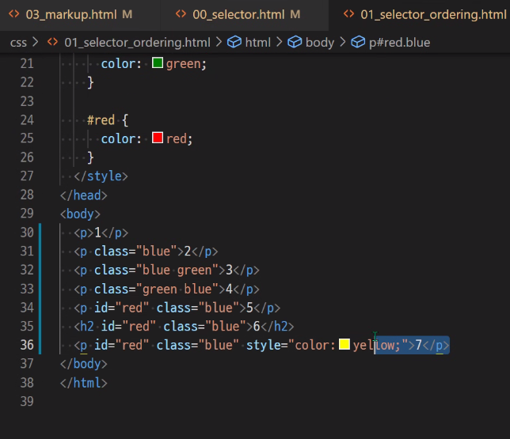
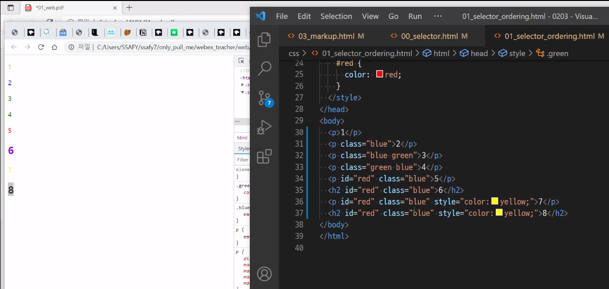
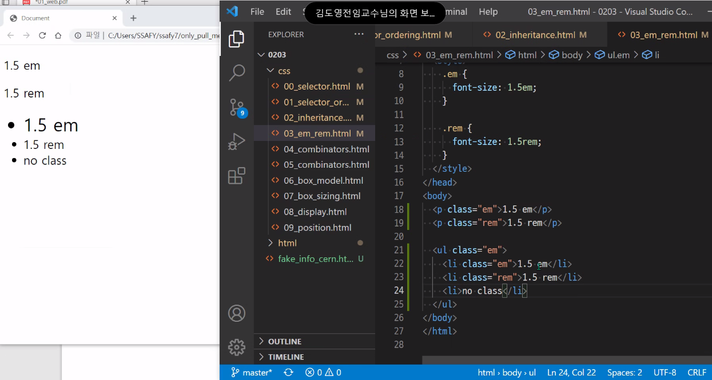
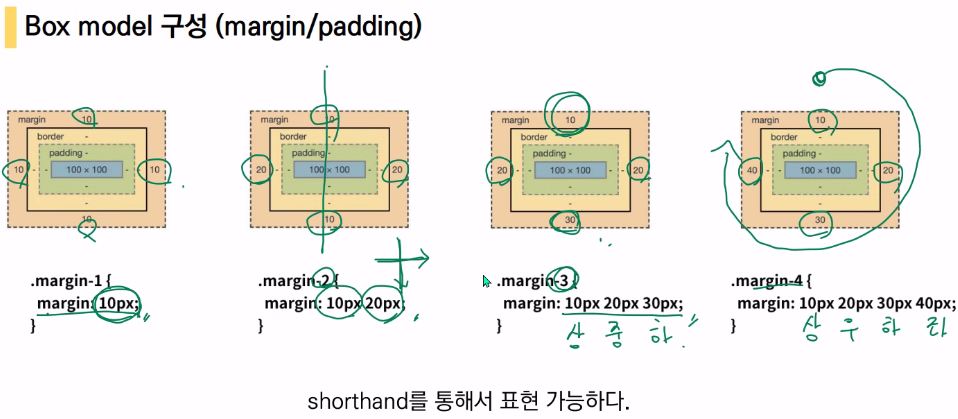
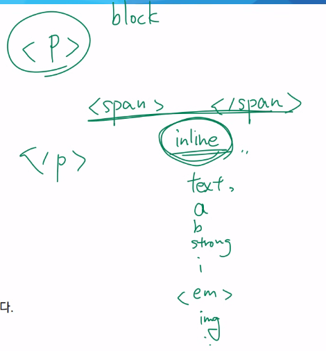
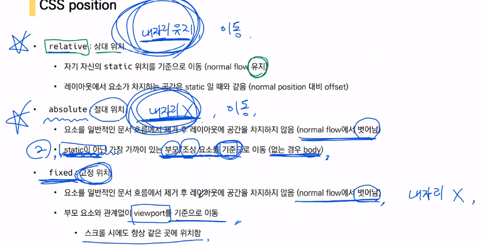

줄 바꿀 때마다 ;(세미콜론) 쓰기

selector + 우선순위 중요!!!

* 선택자(selector) : 외워야 함. 시험에 다른 것들도 나옴.
  * 기본 선택자
  * 결합자
  * 의사 클래스/요소
* CSS 적용 우선순위💥

32, 33 둘다 green

35번 다크바이올렛

36번 다크바이올렛

* 상속

  * text 관련 요소만 상속됨

  

* 크기 단위

  * px(픽셀) : 고정적인 단위
  * % : 가변적인 레이아웃에서 자주 사용
  * em : 바로 위 부모 요소에 대한 배수
  * rem : 최상위 요소(html)의 사이즈를 기준으로 배수 단위를 가짐(root)
  * viewport : 브라우저의 화면 크기

* 결합자
  * 자손 결합자
    * 띄어쓰기로 표현
    * ex) li p { }
  * 자식 결합자
    * 나의 자식만 선택
    * 우측 꺽쇠
    * ex) li > p
* box model
  * normal flow
  * 띄어쓰기로 구분!!  콤마 아님

* box-sizing ✨

# CSS Display

* display : block
* display : inline

* mdn block level element

* CSS position
  * 문서 상에서 요소를 위치 지정
  * absolute : 절대 위치/ 기본값이 아닌 것 위주로

* sticky