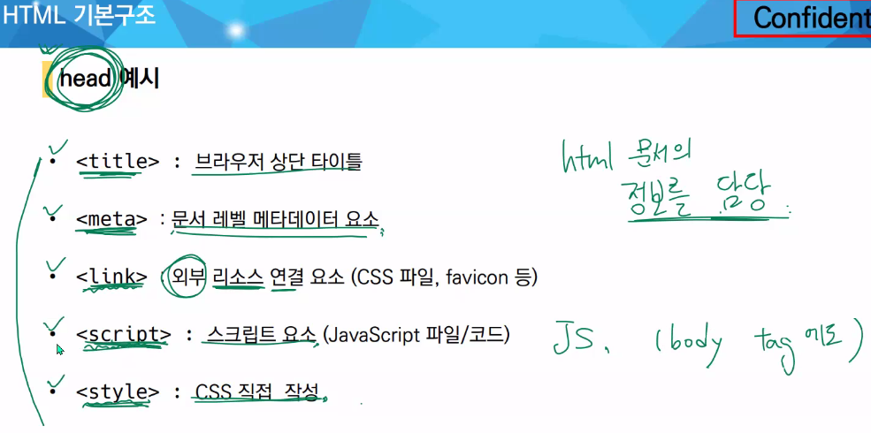

* 요소 (element)
  * br : 개행, hr : 수평선

* og
* DOM 트리

* 마크업 스타일 가이드(2 space)

* 속성

  * 열리는 tag에 속성을 작성
  * 속성명="속성값"  ('=' 앞뒤로 공백 no!!!)

* 시맨틱 태그

  * <head> 
    </head> : 영역

  * "<header>" : 찾아서 적기

  

* 텍스트 요소

* 그룹 컨텐츠

* form
  * Django에서 자주 사용
  * 정보(데이터를) 서버에 제출하기 위한 영역
  * action : form을 처리할 서버의 URL
  * method

** table 시험에 잘 안나옴 **

mdn input 구글링~~

체크박스, 라디오의 name을 동일하게 해야 다중 선택 안됨

